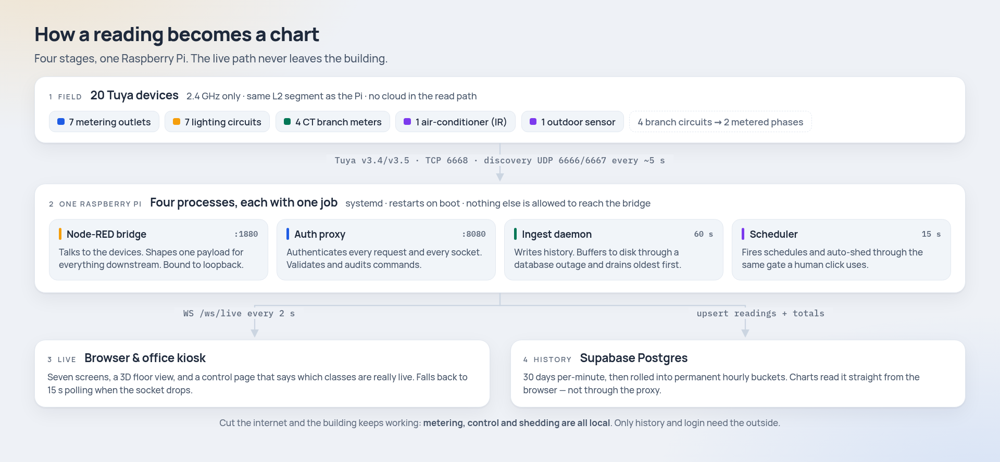
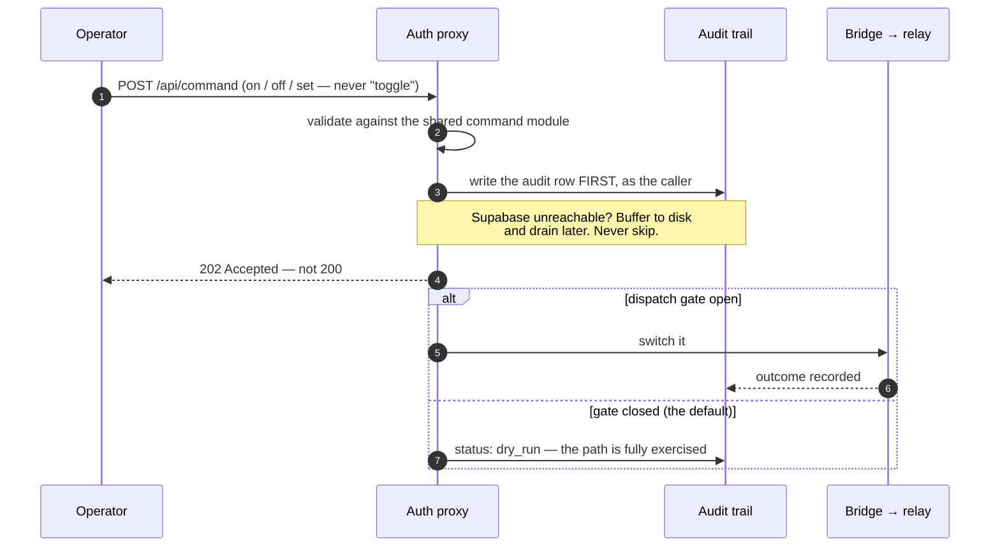

<div align="center">


<br>

[](https://github.com/bems2026/bems/actions/workflows/ci.yml)
[](LICENSE)


**[What it does](#what-it-does)** · **[How it works](#how-it-works)** · **[Control](#control-and-why-it-is-safe-by-default)** · **[Run it](#run-it-no-hardware-needed)** · **[Another building](#put-it-in-another-building)** · **[Docs](#documentation)**

</div>

---

iBEMS meters a university office's electricity, switches its lights, outlets and
air-conditioning from a browser, and sheds load when demand climbs. It runs on **one Raspberry
Pi on the building's own network**, talking to off-the-shelf smart devices over the LAN — so
when the internet goes down, the building keeps working.

It is in daily use at the **MMSU CARE Office (NBERIC)** in Batac City, and it is built to be
stood up again somewhere else: everything site-specific lives in one directory, and a test fails
if that stops being true.

## What it does

<table>

<tr>
<td><b>Overview</b> — live demand, phase balance, today's energy split by branch, the floor plan, and what is scheduled next.</td>
<td><b>Analytics</b> — power, voltage, current and energy over 24 h to a year, per branch and per outlet, with the untracked gap named rather than hidden.</td>
</tr>
<tr>
<td><b>Control</b> — every relay, the air-conditioner's setpoint, and a badge on each class saying whether commands are actually reaching hardware.</td>
<td><b>Devices</b> — the fleet, its readings and its comms state, plus enrolment and removal from the browser.</td>
</tr>
</table>

The fifth tab is **Automation** — per-device schedules staged as drafts until you commit them,
demand thresholds, and load-shed tiers:

> A shed tier is **permission, not size** — it says a load *may* be dropped, not that it is
> large. Nothing without a tier is ever shed: an unclassified device is not a volunteer.

Two more screens sit in the account menu: **Reports** (weekly and monthly rollups with coverage
badges and CSV export) and **Settings** (spaces, floor plan, display, and the air-conditioning
setpoint policy the server enforces).

> [!NOTE]
> Those are screenshots of the real app, taken against the bundled mock bridge — synthetic
> devices, synthetic power, no hardware and no real readings. You can reproduce them in two
> commands; see [Run it](#run-it-no-hardware-needed). The Overview hero is a live 3D model of
> the office in a normal browser; the headless one that takes these shots has no GPU, so it
> shows the app's own 2D floor-plan fallback.

## The fleet

| | Devices | What they do |
|---|---|---|
| **Metering outlets** | 7 | Dual-socket, self-metering. Each socket switches independently. |
| **Lighting circuits** | 7 | Ceiling relays. No metering of their own — their load shows up on a branch meter. |
| **Branch meters** | 4 | CT clamps in the sub-panel, one per branch circuit. |
| **Air-conditioning** | 1 | Commanded by IR, with a minimum setpoint the deployment sets and the server enforces. |
| **Outdoor sensor** | 1 | Temperature and humidity, for the climate cards. |

**20 devices, 11 of them metered.** Four branch circuits hang off the sub-panel and roll up into
two metered phases — the third phase has no meter installed, so the app reports it as *not
metered* rather than as zero. Nothing here counts a missing measurement as an absence of load.

## How it works

<picture>
  <source media="(prefers-color-scheme: dark)" srcset="docs/assets/architecture-dark.png">
  
</picture>

1. **Devices → Node-RED.** The bridge talks Tuya v3.4/v3.5 straight to the devices over the LAN.
   No vendor cloud in the read path. It binds loopback only.
2. **Node-RED → the app.** One payload shape, pushed over a WebSocket every 2 s, with a 15 s
   polling fallback when the socket drops. The transform that builds it
   ([`shared/buildLatest.mjs`](shared/buildLatest.mjs)) is the *same file* the mock bridge
   imports, so a local fake cannot drift from the real one.
3. **Everything goes through the proxy.** [`server/proxy.mjs`](server/proxy.mjs) is the only
   process allowed to reach the bridge. It authenticates every request and every socket upgrade.
4. **History is written separately.** [`server/ingest.mjs`](server/ingest.mjs) polls once a
   minute and upserts to Postgres, buffering to disk through a database outage and draining
   oldest-first. Thirty days of per-minute rows, then rolled into permanent hourly buckets —
   rollup and prune in one transaction.

The contracts are the source of truth, not this summary:
[`docs/bridge-contract.md`](docs/bridge-contract.md) for what the bridge emits,
[`docs/storage-contract.md`](docs/storage-contract.md) for what is stored.

## Control, and why it is safe by default

Switching a relay in an occupied office is not a database write. The command path is built
around that.



- **The audit row is written before anything is touched**, using the caller's own token rather
  than a service key. "A relay moved with no record" is not a representable state.
- **Actions are absolute, never relative.** `on`, `off`, `set` — so a retry after a timeout
  cannot flip something back.
- **202, never 200.** The bridge cannot confirm the relay physically moved, so the API does not
  claim it did.
- **Hardware dispatch is gated and off unless a deployment turns it on.** While closed, the
  whole path still runs and the response says `dry_run` instead of pretending. Both the proxy
  and the scheduler refuse to start half-configured.
- **Auto-shed sheds, and never restores.** Dropping load unattended is recoverable by a person;
  restoring it is not.
- **Schedules use the same path as a human click** — validated, gated, audited, all three.

## Run it, no hardware needed

```bash
npm ci
npm run mock          # a contract-identical fake bridge on :1880
npm run dev           # the app on :5183
```

That is the whole system, minus the building. The mock imports the same transform and the same
command validator as the real bridge, and it can inject the failures worth designing against:

```bash
npm run mock -- --stale=co3        # one device stops updating
npm run mock -- --drop-ws          # the socket dies every 5 s
npm run mock -- --500              # every request fails
npm run mock -- --dispatch=switch  # only lighting really dispatches
```

<details>
<summary><b>The rest of the commands</b></summary>

```bash
npm test               # frontend (vitest)
npm run test:bridge    # bridge/contract (node --test)
npm run test:server    # server (node --test) — not on a live Pi; see CONTRIBUTING.md
npm run lint
npm run build          # tsc -b && vite build
npm run build:flow     # regenerate the Node-RED flow after editing shared/
npm run preflight      # check a real deployment end to end
npm run site:check     # check a site definition offline
```

`npm run dev` deliberately uses port 5183, not Vite's default, so it can never shadow another
project on the same machine. On the Pi, port 1880 is Node-RED — use
`npm run mock -- --port=1881`.

</details>

## Put it in another building

This is a funded milestone, not an aspiration, and
[`docs/replication.md`](docs/replication.md) is written as a transcript of a run that worked —
marking which steps were actually executed and which were only read from the code.

```bash
npm run site:new -- my-building   # scaffold shared/sites/my-building/ — empty, invents nothing
# describe its devices and its circuits, then:
npm run site:check                # conformance: is this site coherent?
npm run build:flow                # regenerate the Node-RED flow for it
npm run mock                      # the whole system, before any hardware exists
npm run dev                       #   (two terminals)

# apply supabase/*.sql in filename order, then on the machine itself:
./scripts/install.sh              # checks and plans. Changes nothing.
./scripts/install.sh --apply      # does it
npm run preflight                 # credentials, database, radio, bridge, services
```

Everything site-specific lives in `shared/sites/<slug>/`, and
[`test/site-config.test.mjs`](test/site-config.test.mjs) fails if any other production module
names a site directory. `site:check` knows nothing about any particular building and everything
about a coherent one — it catches the quiet faults, like a circuit naming a meter that does not
exist, which silently drops that meter from a phase total.

> [!WARNING]
> The CARE test suites **will** fail against a fresh site. They are a regression suite for one
> building, not a conformance suite. `npm run site:check` is what a new site runs.

## What's inside

| | |
|---|---|
| [`shared/`](shared/) | The device registry, the payload transform, the command validator. Edit here; everything downstream is generated. |
| [`src/`](src/) | React 19 + Vite + TypeScript. Seven screens, a hand-written design system, light and dark. |
| [`server/`](server/) | The ingest daemon, the authenticating proxy, the scheduler, the retention and report passes, and the systemd units. |
| [`node-red-bridge/`](node-red-bridge/) | The generated flow, plus the deploy, verify and enrolment scripts for a real Pi. |
| [`mock-bridge/`](mock-bridge/) | The local fake. Same contract, no hardware. |
| [`supabase/`](supabase/) | `schema.sql` and 28 phase migrations, applied in filename order. |
| [`scripts/`](scripts/) | Machine install, preflight, site scaffolding and checks, RF survey. |
| [`test/`](test/) | Bridge and contract tests. |

## Documentation

**[`docs/`](docs/README.md) — ten documents, indexed.** The ones most people want:

- [`bridge-contract.md`](docs/bridge-contract.md) — what the bridge emits. The single source of truth for field names.
- [`storage-contract.md`](docs/storage-contract.md) — what is stored, and how it is rolled up.
- [`replication.md`](docs/replication.md) — standing this up in another building.
- [`adr-001`](docs/adr-001-timeseries-store.md) — why the time-series store is Postgres and not InfluxDB.
- [`ROADMAP.md`](ROADMAP.md) — feature state in full detail, with an id and an evidence path per entry. Start at §0.

## Testing

**200 test files across three suites** — the frontend, the bridge and contract tests, and the
server daemons. Measured on this checkout: **1,069 frontend cases** and **825 bridge cases**,
all passing; the server suite is the remaining 34 files and runs in CI rather than on a
deployed Pi, because it writes under `server/data/` — where a live deployment keeps its command
audit queue.

CI runs all three on **Node 22 and 24**: the Pi runs 22 and development happens on 24, and the
two have already disagreed in a way that showed up only on the Pi. Server and bridge code has no
external dependencies and uses no mocking library — the tests spawn real processes and hand-roll
fake HTTP servers.

> [!IMPORTANT]
> A green suite is not proof that a fix works. A change has shipped green here and changed
> nothing in the building, more than once. CI catches regressions; reading the live system back
> stays mandatory.

## Status

The software is largely complete, and most of what remains is not code — it waits on a person at
the office, an operator decision, hardware that is not yet on the network, or elapsed time.
There is one open fault that is worth stating plainly rather than burying: after a power cycle
the device fleet began flapping, and the vendor's own cloud sees the same flapping from outside
our network, which makes it a radio and network problem rather than a bridge one. Two mitigations
have shipped; the diagnosis continues.

[`ROADMAP.md`](ROADMAP.md) §0 always says what is actually true today, including what has gone
wrong. It is long on purpose — the reasoning is the artefact.

**Not built, and not claimed:** role-based access control (there is one admin role), PDF export
(reports export CSV), and any localisation. A database restore has been documented but never
performed.

## License and credits

[MIT](LICENSE) © 2026 MMSU CARE Office (NBERIC), Mariano Marcos State University, Batac City.

Contributions welcome — [`CONTRIBUTING.md`](CONTRIBUTING.md) has the working rules, most of
which exist because something here went wrong once. Security reports go through
[`SECURITY.md`](SECURITY.md), privately.
