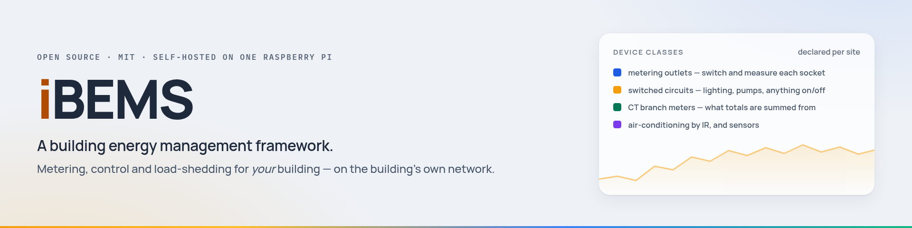
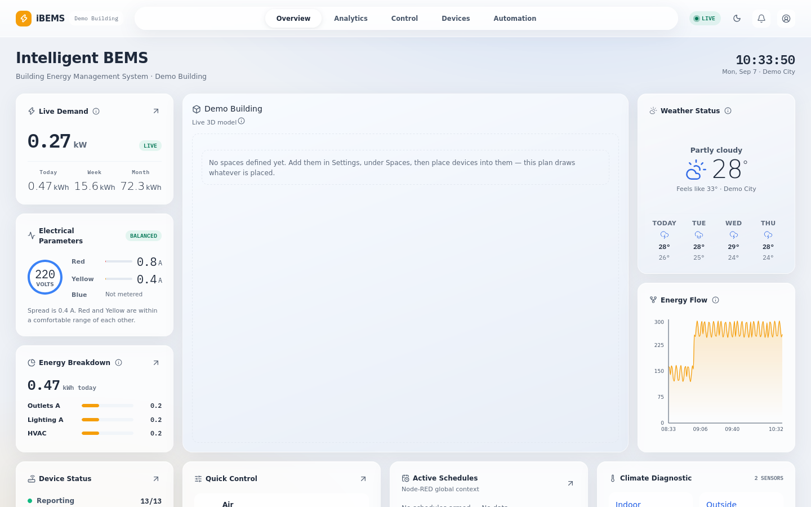
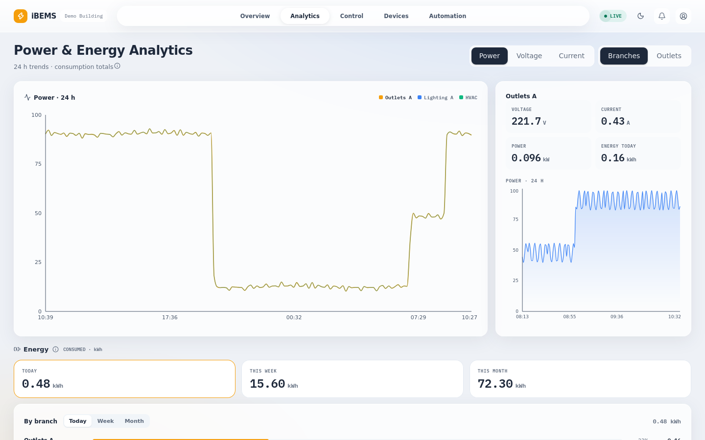
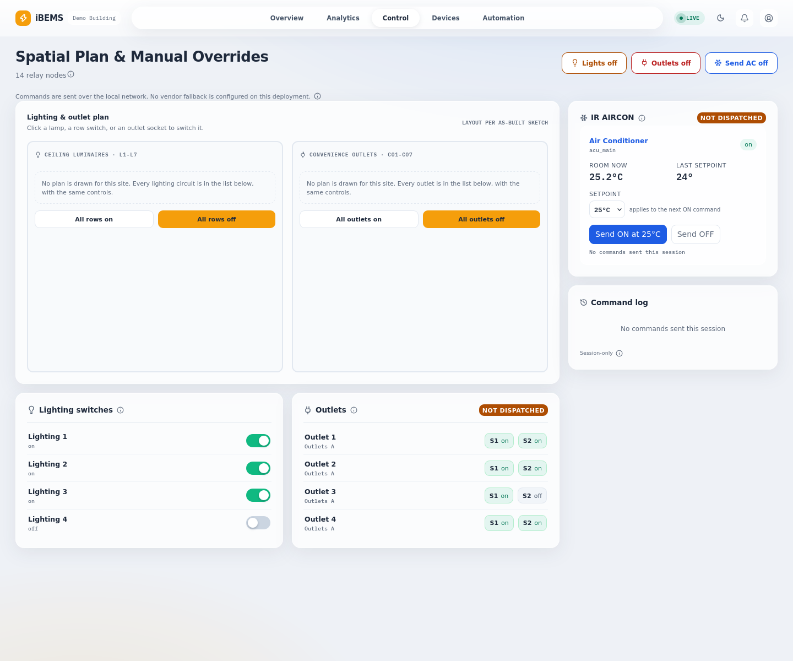
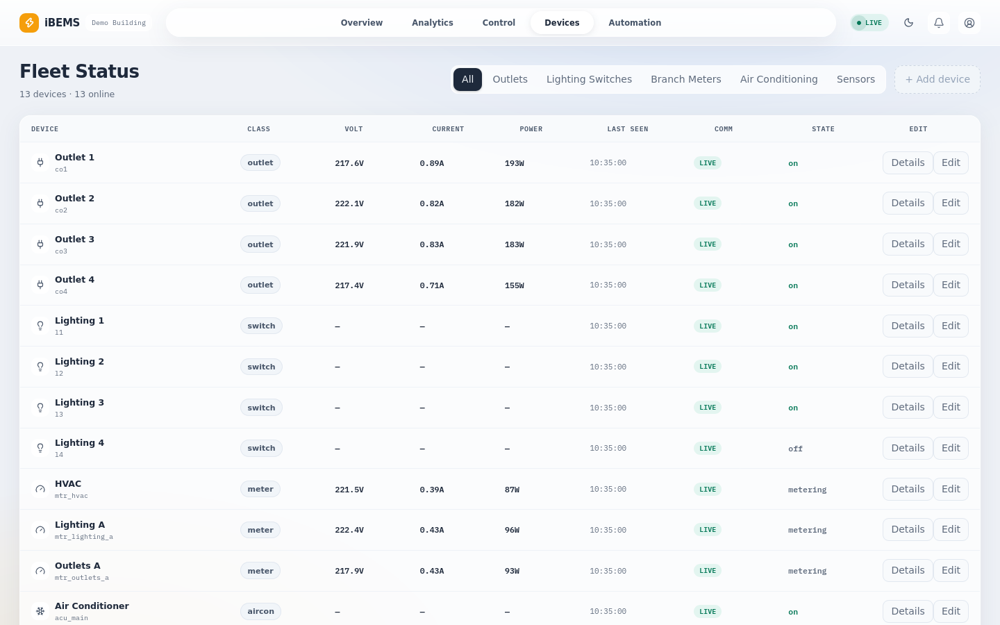
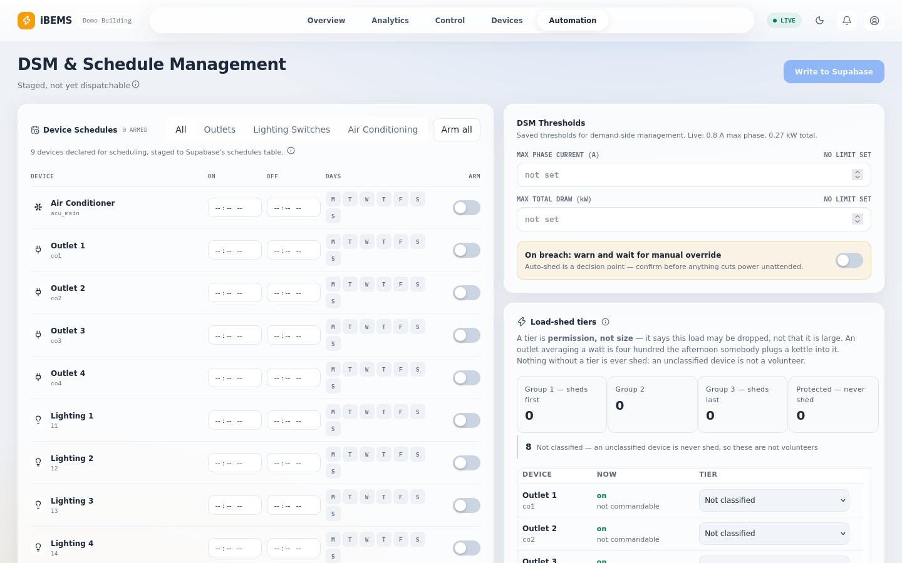

<div align="center">

<picture>
  <source media="(prefers-color-scheme: dark)" srcset="docs/assets/hero-dark.png">
  
</picture>

<br>

[](https://github.com/bems2026/bems/actions/workflows/ci.yml)
[](LICENSE)


**[What it does](#what-it-does)** · **[How it works](#how-it-works)** · **[Your building](#what-a-deployment-declares)** · **[Control](#control-and-why-it-is-safe-by-default)** · **[Run it](#run-it-no-hardware-needed)** · **[Deploy it](#deploy-it-in-your-building)** · **[Docs](#documentation)**

</div>

---

**iBEMS is a building energy management framework.** It meters a building's electricity,
switches its lights, outlets and air-conditioning from a browser, and sheds load when demand
climbs — running on **one Raspberry Pi on the building's own network**, talking to off-the-shelf
smart devices over the LAN. When the internet goes down, the building keeps working.

It is not a product you configure and it is not a demo. It is a working system with the
building-specific parts factored out: **a deployment is one directory describing your devices,
your circuits and your site**, and everything else — the bridge, the daemons, the database
schema, the dashboard — is the framework. A test fails if that stops being true.

One reference deployment has been running an office continuously since 2026. The screenshots
below are the same code against a synthetic building, because that is what you get on your first
`npm run mock`, before any hardware exists.

## What it does

<table>
<tr>
<td width="50%"><a href="docs/assets/shot-overview.png"></a></td>
<td width="50%"><a href="docs/assets/shot-analytics.png"></a></td>
</tr>
<tr>
<td><b>Overview</b> — live demand, phase balance, today's energy split by branch, the floor plan, and what is scheduled next.</td>
<td><b>Analytics</b> — power, voltage, current and energy over 24 h to a year, per branch and per outlet, with the untracked gap named rather than hidden.</td>
</tr>
<tr>
<td><a href="docs/assets/shot-control.png"></a></td>
<td><a href="docs/assets/shot-devices.png"></a></td>
</tr>
<tr>
<td><b>Control</b> — every relay, the air-conditioner's setpoint, and a badge on each class saying whether commands are actually reaching hardware.</td>
<td><b>Devices</b> — the fleet, its readings and its comms state, plus enrolment and removal from the browser.</td>
</tr>
</table>

The fifth tab is **Automation** — per-device schedules staged as drafts until you commit them,
demand thresholds, and load-shed tiers:

<a href="docs/assets/shot-automation.png"></a>

> A shed tier is **permission, not size** — it says a load *may* be dropped, not that it is
> large. Nothing without a tier is ever shed: an unclassified device is not a volunteer.

Two more screens sit in the account menu: **Reports** (weekly and monthly rollups with coverage
badges and CSV export) and **Settings** (spaces, floor plan, display, and the air-conditioning
setpoint policy the server enforces).

> [!NOTE]
> Those are screenshots of the real app running a **demo building that does not exist** —
> thirteen devices, two metered phases, invented from end to end in
> [`docs/assets/demo-site/`](docs/assets/demo-site/). No hardware, no real readings, one command
> to reproduce. It is also, deliberately, a *first run*: the floor plan is empty because nobody
> has defined the spaces yet, and that is what your own first run looks like too.

## How it works

<picture>
  <source media="(prefers-color-scheme: dark)" srcset="docs/assets/architecture-dark.png">
  
</picture>

1. **Devices → Node-RED.** The bridge talks Tuya v3.4/v3.5 straight to the devices over the LAN.
   No vendor cloud in the read path. It binds loopback only.
2. **Node-RED → the app.** One payload shape, pushed over a WebSocket every 2 s, with a 15 s
   polling fallback when the socket drops. The transform that builds it
   ([`shared/buildLatest.mjs`](shared/buildLatest.mjs)) is the *same file* the mock bridge
   imports, so a local fake cannot drift from the real one.
3. **Everything goes through the proxy.** [`server/proxy.mjs`](server/proxy.mjs) is the only
   process allowed to reach the bridge. It authenticates every request and every socket upgrade.
4. **History is written separately.** [`server/ingest.mjs`](server/ingest.mjs) polls once a
   minute and upserts to Postgres, buffering to disk through a database outage and draining
   oldest-first. Thirty days of per-minute rows, then rolled into permanent hourly buckets —
   rollup and prune in one transaction.

The contracts are the source of truth, not this summary:
[`docs/bridge-contract.md`](docs/bridge-contract.md) for what the bridge emits,
[`docs/storage-contract.md`](docs/storage-contract.md) for what is stored.

## What a deployment declares

Everything that belongs to a *place* lives in `shared/sites/<your-slug>/` — three data files, no
logic, no imports. Everything else in this repository is the framework.

| File | What you write in it |
|---|---|
| `site.mjs` | Who you are: slug, display name, timezone and UTC offset, map location, and policy — the air-conditioning minimum setpoint the server enforces, and whether dispatch is `local-only` or `local-first`. |
| `devices.mjs` | Your hardware: one entry per device — id, display name, class, which branch circuit it sits on, and the vendor-specific keys the bridge needs to address it. |
| `circuits.mjs` | Your electrical tree: service entrance → panels → branch circuits, each branch naming its phase and the meter clamped on it. Phase totals are *derived* from this, never hand-written. |

One pointer, [`shared/siteConfig.mjs`](shared/siteConfig.mjs), says which site is active — and
[`test/site-config.test.mjs`](test/site-config.test.mjs) fails if any other production module
names a site directory, so "one directory" is enforced rather than asserted. The site tests
check *shape*, never values, so adding a building does not mean rewriting a suite.

**The five device classes** the framework understands
([`shared/registry.mjs`](shared/registry.mjs)):

| Class | Switchable | Metered | What it is |
|---|---|---|---|
| `outlet_dual` | ✅ each socket | ✅ | A dual-socket smart outlet that meters itself. |
| `switch` | ✅ | — | A relay — a lighting circuit, a pump, anything on/off. Its load is measured by the branch meter above it. |
| `meter` | — | ✅ | A CT clamp on a branch circuit. These are what building totals are summed from. |
| `acu_ir` | ✅ + setpoint | — | Air-conditioning commanded by IR, with a minimum setpoint bounded by hardware *and* narrowed by your own policy. |
| `sensor_temp_humidity` | — | — | Temperature and humidity, indoors or out. |

`outlet_dual` and `switch` can also be **enrolled from the browser** after install, so a
deployment grows without a redeploy. A branch with no meter is reported as *not metered* rather
than as zero — nothing here counts a missing measurement as an absence of load.

## Control, and why it is safe by default

Switching a relay in an occupied building is not a database write. The command path is built
around that.


- **The audit row is written before anything is touched**, using the caller's own token rather
  than a service key. "A relay moved with no record" is not a representable state.
- **Actions are absolute, never relative.** `on`, `off`, `set` — so a retry after a timeout
  cannot flip something back.
- **202, never 200.** The bridge cannot confirm the relay physically moved, so the API does not
  claim it did.
- **Hardware dispatch is gated and off unless a deployment turns it on.** While closed, the
  whole path still runs and the response says `dry_run` instead of pretending. Both the proxy
  and the scheduler refuse to start half-configured.
- **Auto-shed sheds, and never restores.** Dropping load unattended is recoverable by a person;
  restoring it is not.
- **Schedules use the same path as a human click** — validated, gated, audited, all three.

## Run it, no hardware needed

```bash
npm ci
npm run mock          # a contract-identical fake bridge on :1880
npm run dev           # the app on :5183
```

That is the whole system, minus the building. The mock derives its fixture from whatever site is
configured, and imports the same transform and the same command validator as the real bridge, so
it cannot drift from it. It can inject the failures worth designing against:

```bash
npm run mock -- --stale=<device>   # one device stops updating
npm run mock -- --drop-ws          # the socket dies every 5 s
npm run mock -- --500              # every request fails
npm run mock -- --dispatch=switch  # only some classes really dispatch
```

<details>
<summary><b>The rest of the commands</b></summary>

```bash
npm test               # frontend (vitest)
npm run test:bridge    # bridge/contract (node --test)
npm run test:server    # server (node --test) — not on a live Pi; see CONTRIBUTING.md
npm run lint
npm run build          # tsc -b && vite build
npm run build:flow     # regenerate the Node-RED flow after editing shared/
npm run preflight      # check a real deployment end to end
npm run site:check     # check a site definition offline
```

`npm run dev` deliberately uses port 5183, not Vite's default, so it can never shadow another
project on the same machine. On a Pi running the bridge, port 1880 is Node-RED — use
`npm run mock -- --port=1881`.

</details>

## Deploy it in your building

```bash
npm run site:new -- my-building    # scaffold shared/sites/my-building/ — empty, invents nothing
# describe your devices and your circuits in the three files, then:
npm run site:check                # conformance: is this site coherent?
npm run build:flow                # generate the Node-RED flow for YOUR devices
npm run mock                      # the whole system, before any hardware exists
npm run dev                       #   (two terminals)

# apply supabase/*.sql in filename order, then on the machine itself:
./scripts/install.sh              # checks and plans. Changes nothing.
./scripts/install.sh --apply      # does it
npm run preflight                 # credentials, database, radio, bridge, services
```

`site:new` scaffolds **empty** device and circuit lists and a UTC timezone — it invents no
facts about a building it has never seen — and it deliberately does not activate the site,
because that would take a running building offline. `site:check` knows nothing about any
particular building and everything about a coherent one: it catches the quiet faults, like a
circuit naming a meter that does not exist, which silently drops that meter from a phase total.

`install.sh` is a dry run by default, is idempotent, and never touches Wi-Fi, never widens the
MQTT broker past loopback, never writes secrets and never deploys the flow. `preflight` is the
day-one check — credentials, database, vendor account, the local radio segment, the bridge, the
services — and it reports what it *could not* check rather than passing it.

[`docs/replication.md`](docs/replication.md) is the full walkthrough, written as a transcript of
a run that worked: it marks which steps were actually executed and which were only read from the
code, and it carries a table of what it does not cover.

> [!WARNING]
> The reference deployment's test suites **will** fail against a fresh site. They are a
> regression suite for one building, not a conformance suite. `npm run site:check` is what a new
> site runs.

## What's inside

| | |
|---|---|
| [`shared/`](shared/) | The framework's core: device registry, payload transform, command validator — and `sites/`, where each deployment describes itself. Edit here; everything downstream is generated. |
| [`src/`](src/) | React 19 + Vite + TypeScript. Seven screens, a hand-written design system, light and dark. |
| [`server/`](server/) | The ingest daemon, the authenticating proxy, the scheduler, the retention and report passes, and the systemd units. |
| [`node-red-bridge/`](node-red-bridge/) | The generated flow, plus the deploy, verify and enrolment scripts for a real Pi. |
| [`mock-bridge/`](mock-bridge/) | The local fake. Same contract, no hardware, any site. |
| [`supabase/`](supabase/) | `schema.sql` and 28 phase migrations, applied in filename order. |
| [`scripts/`](scripts/) | Machine install, preflight, site scaffolding and checks, RF survey. |
| [`test/`](test/) | Bridge and contract tests. |

## Requirements

- A **Raspberry Pi** (or any Linux machine) on the same 2.4 GHz layer-2 segment as the devices,
  without client isolation. The field devices are 2.4 GHz-only, and the bridge finds them by
  local broadcast — a host on a 5 GHz SSID has working internet and sees every device offline.
- **Node 22 or 24.** Both are tested; the reference deployment runs 22.
- **Tuya-protocol smart devices** speaking v3.4 or v3.5 over the LAN, and a vendor developer
  account — which is what lets enrolment read a device's local key instead of asking a human to
  copy secrets between browser tabs.
- **A Postgres database** for history. Supabase is what the schema and the row-level security
  policies are written against; see [ADR-001](docs/adr-001-timeseries-store.md) for why it is
  Postgres and not a purpose-built time-series store.

## Documentation

**[`docs/`](docs/README.md) — ten documents, indexed.** The ones most people want:

- [`replication.md`](docs/replication.md) — standing this up in your own building.
- [`bridge-contract.md`](docs/bridge-contract.md) — what the bridge emits. The single source of truth for field names.
- [`storage-contract.md`](docs/storage-contract.md) — what is stored, and how it is rolled up.
- [`physical-install.md`](docs/physical-install.md) — CT clamps, relays and the IR blaster. A template with its gaps marked, not a finished guide.
- [`adr-001`](docs/adr-001-timeseries-store.md) — why the time-series store is Postgres and not InfluxDB.
- [`ROADMAP.md`](ROADMAP.md) — feature state in full detail, with an id and an evidence path per entry. Start at §0.

## Testing

**202 test files across three suites** — the frontend, the bridge and contract tests, and the
server daemons. Measured on this checkout: **1,069 frontend cases** and **845 bridge cases**,
all passing; the server suite is the remaining 34 files and runs in CI rather than on a
deployed Pi, because it writes under `server/data/` — where a live deployment keeps its command
audit queue.

CI runs all three on **Node 22 and 24**: a deployment runs 22 and development happens on 24, and
the two have already disagreed in a way that showed up only on the Pi. Server and bridge code
has no external dependencies and uses no mocking library — the tests spawn real processes and
hand-roll fake HTTP servers.

> [!IMPORTANT]
> A green suite is not proof that a fix works. A change has shipped green here and changed
> nothing in the building, more than once. CI catches regressions; reading the live system back
> stays mandatory.

## Status

The software is largely complete, and most of what remains in the reference deployment is not
code — it waits on a person at the site, an operator decision, hardware that is not yet on the
network, or elapsed time.

Worth stating plainly rather than burying: that deployment currently has a device fleet that
flaps after a power cycle, and the vendor's own cloud sees the same flapping from outside the
local network — which makes it a radio and network problem rather than a bridge one. Two
mitigations have shipped; the diagnosis continues. If you deploy this, read
[`ROADMAP.md`](ROADMAP.md) §0 first: it always says what is actually true today, including what
has gone wrong. It is long on purpose — the reasoning is the artefact.

**Not built, and not claimed:** role-based access control (there is one admin role), PDF export
(reports export CSV), and any localisation. A database restore has been documented but never
performed.

## License and credits

[MIT](LICENSE) — see the file for the copyright holder. Use it, fork it, put it in your own
building.

Contributions welcome — [`CONTRIBUTING.md`](CONTRIBUTING.md) has the working rules, most of
which exist because something here went wrong once. Security reports go through
[`SECURITY.md`](SECURITY.md), privately.
