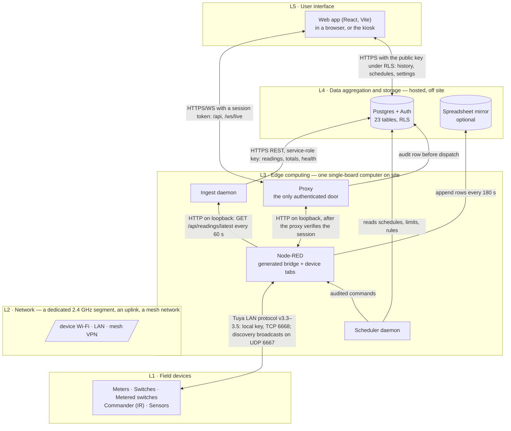
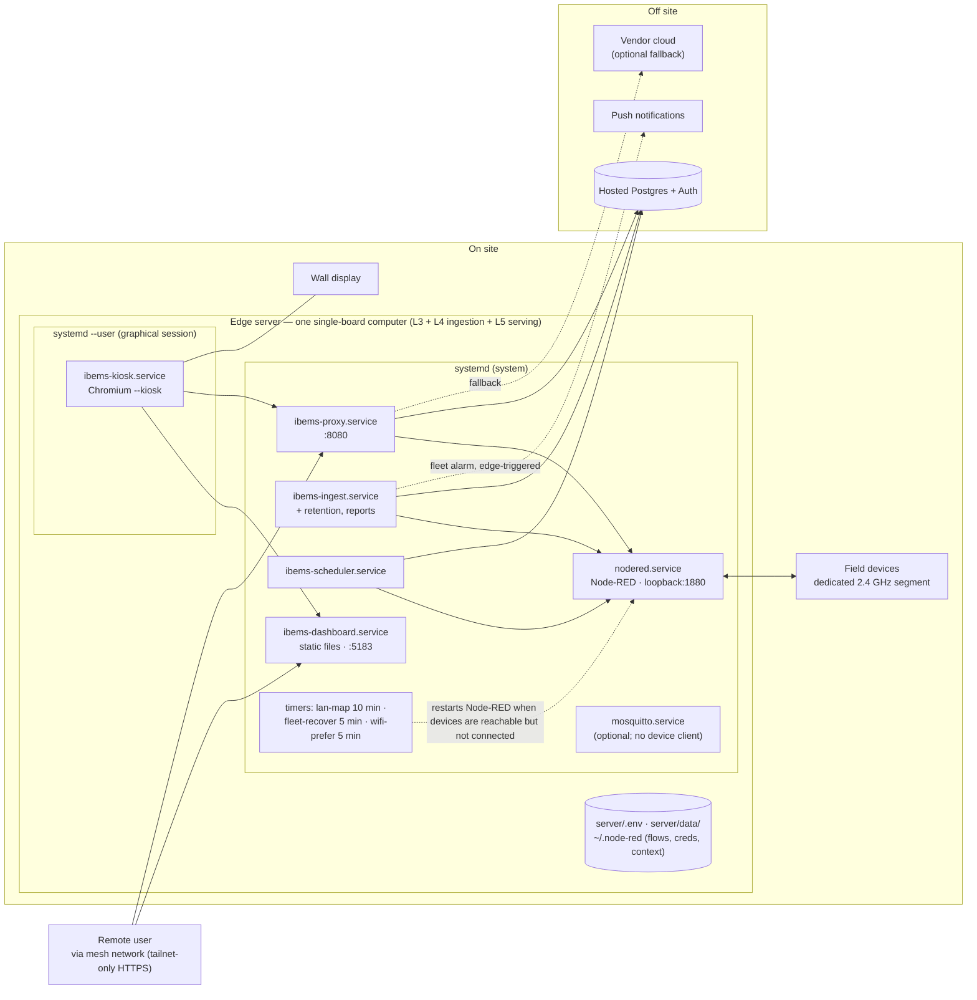
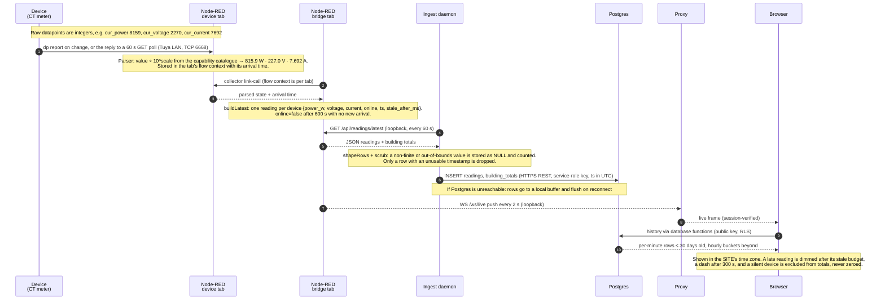
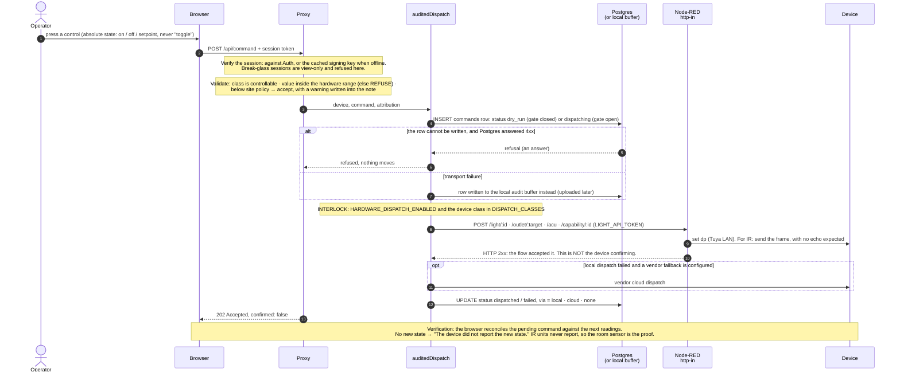

# Overview

iBEMS measures a building's electricity circuit by circuit, switches the loads it is allowed to switch, and keeps an
honest record of both. It is built to be copied. The hardware is consumer smart-home devices and a single-board computer
[E-011, E-051], and every part of the software is in one public repository.

This chapter says what the system is, the rules it keeps, how its parts fit, and **what state each feature is in**.
Every statement about the system as built carries an evidence tag; the [manual's front page](README.md#how-to-read-the-evidence-tags)
explains them.

## What iBEMS is

| It does | How | Status |
|---|---|---|
| Measures consumption by circuit and by outlet, every minute | CT branch meters and metered outlets report to the edge server, which writes one row per device per minute | Field-validated [E-080, E-086] |
| Shows the building live, and its history | A web app, on a wall display and in any browser | Field-validated [E-023, E-060] |
| Switches lights and plug loads by hand | Audited commands through the edge server, gated by a hardware interlock | Field-validated [E-041, E-084] |
| Runs schedules | Stored in the database and fired by the edge server's scheduler | Field-validated [E-084] |
| Keeps demand under a limit | Automatic shedding, one group at a time, never restoring by itself | Field-validated [E-084, E-087, E-123] |
| Holds a room at a comfort target | An infrared commander, stepped by a room-temperature loop | Field-validated [E-084, E-113] |
| Flags unusual consumption | Rolling statistics: two tests must agree | Field-validated [E-076, E-080] |
| Produces reports | Daily, weekly and monthly figures with their coverage, exportable as CSV | Field-validated [E-080; ROADMAP EX-033] |
| Keeps control through an internet outage | A local audit buffer and offline session checks | Field-validated for ingestion [E-134]; implemented for commands [E-078] |
| Reaches the building from off site | Over a private mesh network, never exposed to the internet | Implemented; configured on the edge [E-026] |

Planned items (generation from the solar inverter, occupancy and daylight sensing, prediction) are listed only in
[94 Roadmap](94-roadmap.md).

## Principles

The feature list follows from a handful of rules, applied at every layer. Each is enforced in code, not just stated.

1. **Never state what the system cannot see.** A missing value shows a dash, never a zero. A silent device is excluded
   from totals, not counted as nothing. A gap in the record stays a gap [E-082, E-111]. "Online" means a message
   *arrived*, not that a number changed. *Known limit:* stored offline rows can carry a held value. Every aggregate
   filters them out, and any new query must too [E-083].
2. **One registry; everything else is generated.** One file describes a building's devices. The Node-RED bridge,
   the mock bridge and the payload transform all come from it, so nothing is repeated per device [E-062, E-063, E-127].
   This is what makes a second building cheap.
3. **Record before you act.** A command is written to the audit trail before anything is sent, together with the
   interlock's decision. No record, no switching [E-065, E-122].
4. **The building stays controllable with no internet.** The devices are local and so is control. If the database
   cannot be reached, commands are recorded in a local buffer and readings are queued until the link returns
   [E-078, E-134]. A database *refusal* is an answer and still refuses; only a failed connection is buffered [E-128].
5. **Shed, never restore.** Switching a load off unattended can be undone by a person; switching it on cannot
   [E-123].
6. **Refuse rather than guess.** Commands are absolute ("on", "off", a setpoint), never "toggle". A value outside the
   hardware range is refused [E-128, E-138].
7. **Dry run by default.** Every script that touches the live flow, and the installer, prints its plan and changes
   nothing without `--apply` [E-128, E-129].
8. **Never cry wolf.** Alerts fire on a change of state, not on every check that finds the same state [E-128].
9. **The repository is public.** No keys, tokens, passwords, host names or addresses in code, documents or commit
   messages. Site-specific values live on the edge server only.
10. **Every claim carries evidence, and a passing test suite is not proof.** Changes are read back from the running
    system.

## Architecture: five layers, three planes

The system is described in five layers, following the usual IoT reference model (perception, network, middleware,
application, business) and the building-automation tiers (field, automation, management). Three **planes** cut across
the layers: security, control logic and operations. They are not stages that data passes through.

**Figure 1 — the layers, and the real messages between them.** Source: [`diagrams/layers.mmd`](diagrams/layers.mmd).

| Layer | Owns | Named technology, as built |
|---|---|---|
| **L1 Field devices** | The six roles: Meter, Switch, Metered switch, Sensor, Commander, Source ([01a](01a-device-roles.md)) | Tuya-ecosystem Wi-Fi devices speaking the Tuya LAN protocol v3.3–3.5: CT branch meters (one box can carry two channels), dual-socket metered outlets, relay light switches and an infrared hub that also senses the room [E-051, E-125] |
| **L2 Network** | The dedicated device segment, addressing, the local control path, uplink and remote access ([02](02-network.md)) | A 2.4 GHz Wi-Fi segment; a mesh VPN (Tailscale) with tailnet-only HTTPS [E-026] |
| **L3 Edge computing** | Parsing, deciding, dispatching and supervising; everything that must survive an outage ([03](03-edge.md)) | Raspberry Pi 4 (8 GB), Debian 13, Node.js 22, Node-RED 4.1.8, systemd [E-010, E-011, E-017, E-018, E-021] |
| **L4 Data** | The system of record, ingestion and retention ([04](04-data.md)) | Supabase (hosted Postgres + Auth): 23 tables, row-level security, no anonymous policies [E-064, E-161]. A Google Sheets mirror is optional and secondary [E-058]. |
| **L5 Interface** | Seeing and acting, on the wall display or remotely ([05](05-interface.md)) | React 19, Vite 8, TypeScript, zustand; seven pages [E-060] |

| Plane | Cuts across | Why it is a plane, not a layer |
|---|---|---|
| **X1 Security and access** ([X1](X1-security.md)) | L1–L5 | Credentials exist at every layer. Covering them per layer scatters the one inventory that must be complete. |
| **X2 Control and automation** ([X2a strategy](X2a-control-strategy.md), [X2 realisation](X2-control-logic.md)) | L1–L3, configured from L5 | It is decided at the edge, executed in the field and configured from the UI: a band, not a floor. |
| **X3 Operations and lifecycle** ([X3](X3-operations.md)) | L1–L5 | Commissioning, backup, updates, spares and handover apply to the whole system. |

**Logical layers are not machines.** One edge server hosts L3 and also the L4 ingestion, the L5 web server and the
proxy. The only off-site component is the hosted database and its sign-in service (Figure 2).

## What runs where

**Figure 2 — deployment: what runs on which machine, and what supervises it.** Source:
[`diagrams/deployment.mmd`](diagrams/deployment.mmd).

Every long-running process is a systemd unit that restarts itself on failure. The kiosk is a *user* unit, because it
must run inside the logged-in graphical session [E-021, E-023]. How to build and supervise all of it is in
[03 Edge](03-edge.md).

## Following one reading and one command

**Figure 3 — one reading, device to screen, with the transform and units at each hop.** Source:
[`diagrams/data-path.mmd`](diagrams/data-path.mmd). The example values are a real stored reading [E-080, E-135].

Evidence for the hops: the scaling [E-135]; the poll cadences [E-056]; the online, late and expired thresholds
[E-110, E-111]; the scrub [E-138]; outage buffering [E-134]; retention [E-070]; access to history through database
functions [E-126, E-161]; site-time display [E-137].

**Figure 4 — one command, screen to device.** It shows the audit write before dispatch, the interlock, and where
acknowledgement does and does not exist. Source: [`diagrams/command-path.mmd`](diagrams/command-path.mmd).

Evidence for the steps: session verification and break-glass [E-066, E-128]; validation [E-120, E-138]; record-first
with the gate's decision [E-065, E-122]; the interlock, observed **open** on this deployment [E-041]; the local buffer
and the 4xx rule [E-078, E-128]; the `202` acknowledgement [E-138]; browser-side verification [E-115].

!!! warning "Hardware dispatch is enabled on the pilot deployment"
    `HARDWARE_DISPATCH_ENABLED` was observed as `true` on 2026-09-23, and commands have reached relays since
    2026-08-24 [E-041, E-084]. A new deployment starts with it unset, which means closed. Opening it is a signed-off
    step in commissioning: [X2 § dispatch interlock](X2-control-logic.md).

## How this manual is organised

The [front page](README.md) gives a reading path for each role. The order of the chapters follows the layers (01–05),
then the planes (X1–X3), then building a new site (90), then the references (91–94). The pilot site appears only in
[99](99-worked-example.md).
