# Device roles and catalogue

What each device does, how it is driven, and how to choose, install and test it. Written to apply to any building.

| | |
|---|---|
| **Who this is for** | Anyone setting up an iBEMS in their own institution. No building-automation experience is assumed. |
| **What it covers** | Twelve device types, each with a function block diagram, plus selection, installation, states and troubleshooting. |
| **Companion chapters** | [Control strategy and test manual](X2a-control-strategy.md) for how decisions are made. [Field devices](01-field-devices.md) for sizing, panel work, pairing, calibration and maintenance. |
| **Before you begin** | A licensed electrical practitioner for any work on fixed wiring, and the building owner's permission. |

## 1. The typical field device

Brands differ; the anatomy does not. Almost every device is the same four parts in a box, and **which of the two
optional parts it has decides what it can do for you**.

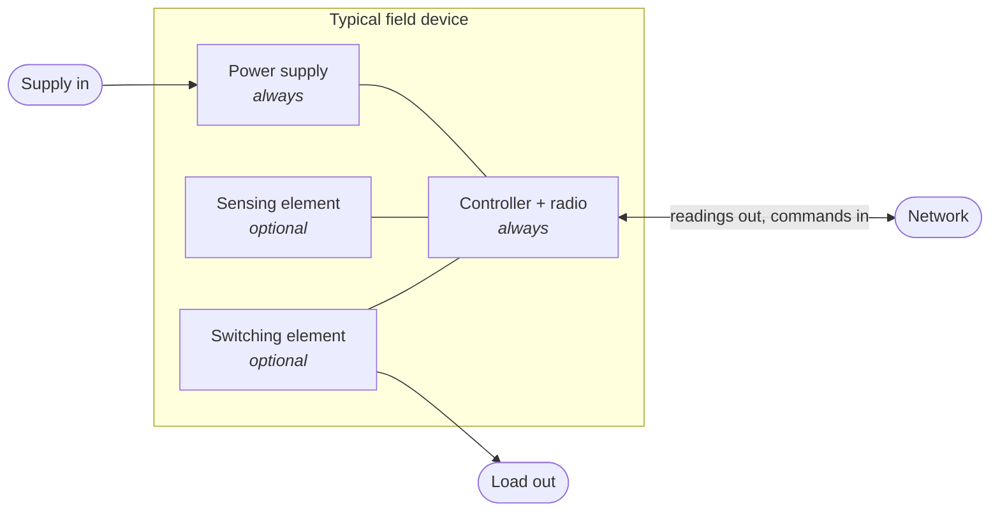

Sensing only, switching only, both, or neither: that is the whole of [section 2](#2-the-six-device-roles).

### The device record

Fill this in for every device before you buy anything. Keep it as a spreadsheet. It becomes your purchase list, your
register and your test sheet.

| Field | Example | Why it matters |
|---|---|---|
| Short code | LIGHT-01 | It never changes. Everything refers to the device by this. |
| Name | Corridor lights | What a person calls it. It may change freely. |
| Role | S | One of the six in section 2. |
| Where it is | Ground floor · corridor | For grouping, and for finding it again. |
| What it is wired to | Panel A · circuit 3 | A circuit can cross several rooms, so keep it separate from location. |
| Reports / accepts | state / on, off | A blank "accepts" means read-only. Write the limits down too. |
| How it is reached | local address + key | Keep the key on the controller only, never in a document. |
| Health signal | reports every 60 s | How you will know it is alive. See section 6. |
| Shed group | Group 2 | Whether it may be switched off automatically. Blank means never. |

## 2. The six device roles

Every field device plays one of these six roles, defined only by what crosses its boundary. **Design around the role,
not the brand.**

| Role | Name | Crosses the boundary | Use it when |
|---|---|---|---|
| M | Meter | Data out only | You need to know consumption but must never switch that circuit. |
| S | Switch | Command in, state out | You need to switch a circuit, and measuring it is not required. |
| MS | Metered switch | Command in, data and state out | You need both, on a load reachable by a plug or one circuit. |
| E | Sensor | Data out only | Automation should react to conditions, not only the clock. |
| C | Commander | Command in, nothing out | The equipment accepts only its own remote and must not be switched at the supply. |
| G | Source | Data out only | The building produces or stores energy. |

!!! warning "Rule"
    **Never use S where the equipment needs C.** Air-conditioners, refrigeration and anything with a compressor must
    not have their supply cut by an automation system.

## 3. Device catalogue

Twelve device types, each as a **function block diagram**: what goes in on the left, what the device does in the middle,
and what comes out on the right. The tags show what can trigger each function; the full explanation is in
[Control strategy § The four triggers](X2a-control-strategy.md#2-the-four-triggers).

| Tag | Means the function starts because… |
|---|---|
| `command` | a person asked for it. |
| `time` | a clock reached a set time, or a poll came round. |
| `event` | the device itself detected something and reported it. |
| `condition` | a measured value crossed a limit you set. |

**Support in iBEMS today.** The software has device classes for five of the twelve types: lighting switch, metered
outlet, branch meter, air-conditioner commander, and temperature and humidity sensor [E-110]. At the pilot site the
first four are installed and reporting [E-051]. The room's temperature and humidity come from the air-conditioner
commander's own sensor, and the stand-alone sensor was never installed [E-125]. The other seven types are described so
that you can plan for them. Each one is marked
**Planned: no device class yet**, and the roadmap chapter ([94-roadmap](94-roadmap.md)) says what building one needs.

### 3.1 Lighting circuit switch — S

*Supported in iBEMS: field-validated [E-051].* Opens and closes one lighting circuit. The most common device in any
iBEMS, and usually the first one automated.

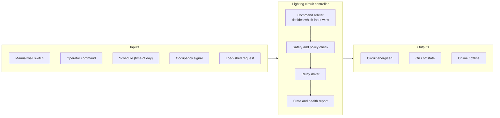

| Function | Trigger |
|---|---|
| On / off | `command` |
| Weekly schedule | `time` |
| Occupancy link (optional) | `event` |
| Manual override always available | `command` |
| Load-shed member | `condition` |
| State and health report | `event` |

**Decide before installing:** which days and hours the schedule covers; whether occupancy may override the schedule; the
shed group, or "never"; what happens after a power cut (on, off, or last state).

### 3.2 Metered outlet — MS

*Supported in iBEMS: field-validated [E-051].* Switches and measures plug loads, socket by socket. The easiest way to
find and remove out-of-hours waste.

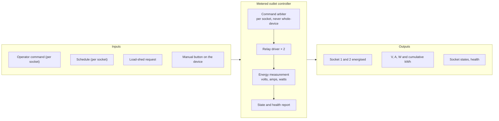

| Function | Trigger |
|---|---|
| On / off per socket | `command` |
| Schedule per socket | `time` |
| Live power measurement | `time` |
| Cumulative energy | `time` |
| Load-shed member | `condition` |
| State and health report | `event` |

**Decide before installing:** which socket carries which load (write it on the device); whether both sockets share one
schedule; the shed group per socket; the maximum load, with margin.

### 3.3 Branch energy meter — M

*Supported in iBEMS: field-validated [E-051].* Measures one circuit and never switches it. Your only source of truth for
where the energy actually goes.

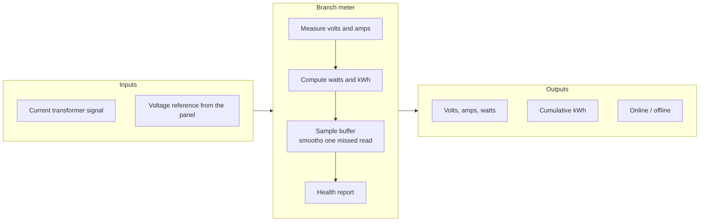

| Function | Trigger |
|---|---|
| Continuous measurement | `time` |
| Reports on change | `event` |
| Feeds phase and building totals | `time` |
| Feeds the demand limit | `condition` |
| No control function: read-only | — |

**Decide before installing:** which circuit each clamp is on (photograph it); the clamp direction (arrow towards the
load); whether this circuit joins the building total; its share of any phase total.

!!! warning "A meter is only as good as its label"
    A clamp on an unrecorded circuit produces confident numbers about the wrong load, and nobody will notice for months.

### 3.4 Air-conditioner commander — C

*Supported in iBEMS: field-validated [E-051].* Sends the unit its own remote-control codes. You set the temperature you
want in the room, and the commander then trims the setpoint it sends to the unit until the room actually gets there.

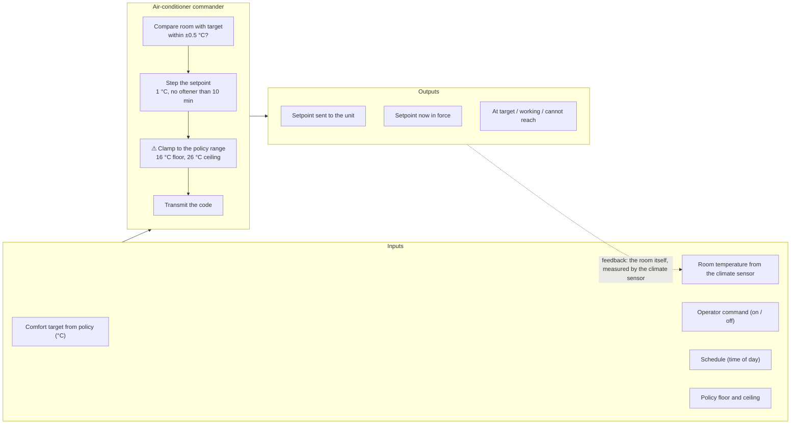

| Function | Trigger |
|---|---|
| Policy sets the room target, not a raw unit setpoint | `command` |
| A new sensor reading arrives: compare it with the target | `event` |
| Room warmer than target → step the unit setpoint down | `condition` |
| Room cooler than target → step the unit setpoint back up | `condition` |
| One step of 1 °C, never oftener than every 10 minutes | `time` |
| Within ±0.5 °C of target → hold, change nothing | `condition` |
| Floor 16 °C and ceiling 26 °C never exceeded | `condition` |
| Sensor silent → freeze the setpoint where it is | `event` |
| At the floor and still not reaching target → report it | `condition` |
| On and off by schedule | `time` |

**Decide before installing:**
- The comfort target people actually want in the room. This is what policy sets.
- The floor and ceiling the unit may be driven between. 16 °C and 26 °C are sensible starting values.
- How long to wait between steps. The room must have time to react before you step again.
- Which sensor speaks for this room, and where it is mounted.
- How long the unit may sit at the floor with no progress before it is reported as unable to reach target.
- The exact codes the unit accepts. Capture them at install.

!!! note "As built in iBEMS"
    The loop's defaults are a 0.5 °C deadband, 1 °C steps and 600 s between steps, as above. **Its hard range is
    16–30 °C**, the degrees the infrared library holds codes for, and there is no separate 26 °C ceiling [E-112]. Site
    policy adds two floors of its own: the coldest setpoint a person may request, and the coldest room target a rule may
    aim for [E-113]. A stale or missing sensor reading produces no step, and hitting the floor or the ceiling raises a
    named alert [E-112].

!!! warning "The unit still never answers — the room answers for it"
    Nothing comes back from the air-conditioner, so the sensor reading is the only evidence a command landed. That is
    what makes this worth doing. If the setpoint keeps stepping down and the room does not move, you have found a fault
    (a missed code, a door propped open, or a unit switched off at the wall) instead of quietly cooling nothing.

### 3.5 Temperature and humidity sensor — E

*Supported in iBEMS: implemented, not validated. The device class exists, but the pilot's stand-alone sensor was never
installed; there, the room reading comes from the commander's own sensor (3.4) [E-125].* Measures the condition you are
actually trying to control, and closes the loop around the air-conditioner (3.4). Without it, air-conditioning can only run on a clock and hope.

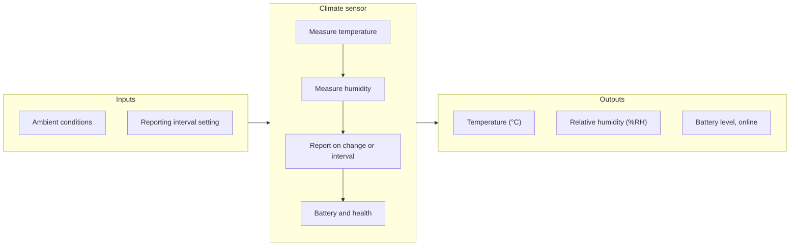

| Function | Trigger |
|---|---|
| Continuous measurement | `time` |
| Reports when the value moves | `event` |
| Closes the loop on the air-conditioner setpoint | `condition` |
| Feeds comfort records | `time` |

**Decide before installing:** mounting height and position (away from sun, vents and doors); the reporting interval,
balanced against battery life; which room or zone it represents; the comfort band it will be compared against.

### 3.6 Occupancy sensor — E

*Planned: no device class yet ([94-roadmap](94-roadmap.md)).* Reports whether a space is in use. It turns lighting and
ventilation from a guess about the timetable into a fact about the room.

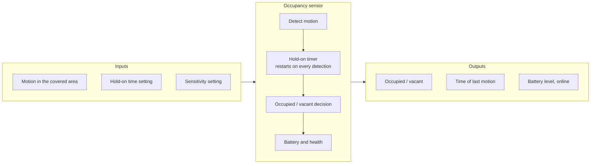

| Function | Trigger |
|---|---|
| Detect presence | `event` |
| Hold "occupied" for a set time after the last motion | `time` |
| Release to "vacant" | `time` |
| Trigger lighting or ventilation | `event` |

**Decide before installing:** the hold-on time (the single most important setting); coverage of the whole space, not the
doorway; which circuits it may switch; whether it may override a schedule, or only add to it.

!!! warning "Set the hold-on time generously — 15 to 20 minutes for offices"
    Too short, and the lights drop on people sitting still. Staff will then disable the whole system rather than report it.

### 3.7 Daylight sensor — E

*Planned: no device class yet.* Measures how much natural light a zone already has, so artificial lighting is not run
against a bright window.

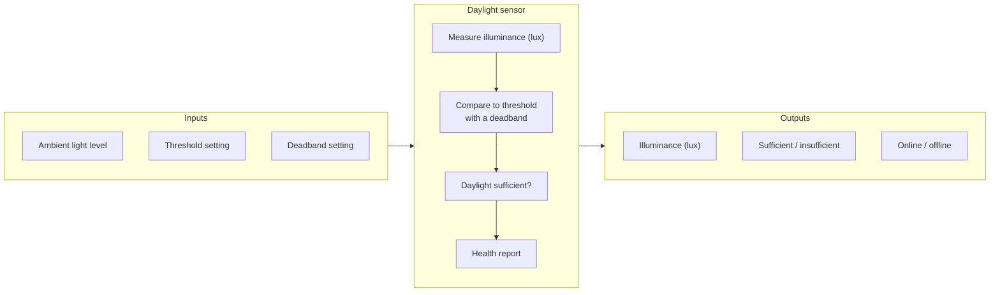

| Function | Trigger |
|---|---|
| Continuous measurement | `time` |
| Cross a threshold | `condition` |
| Suppress or release the lighting schedule | `condition` |
| Reports on change | `event` |

**Decide before installing:** the lux threshold for "enough light"; a deadband so it does not flicker at the boundary;
which zones it governs; whether it dims or only switches.

!!! warning "A threshold without a deadband will cycle the lights"
    Use one level to switch off, and a clearly lower level to switch back on.

### 3.8 Air-quality sensor — E

*Planned: no device class yet.* Measures CO₂ as a proxy for how many people are in a room and how stale the air is, so
ventilation runs on need.

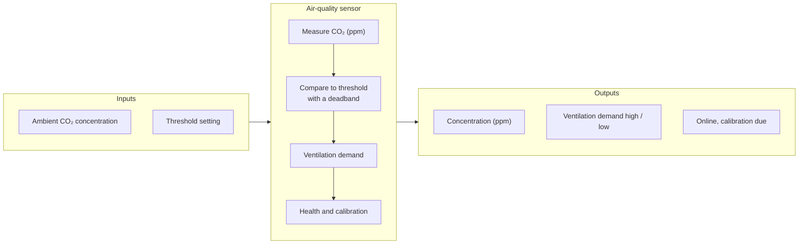

| Function | Trigger |
|---|---|
| Continuous measurement | `time` |
| Cross a threshold | `condition` |
| Call for ventilation | `condition` |
| Reports on change | `event` |

**Decide before installing:** the ppm threshold for calling ventilation; a deadband, as with daylight; which fan or unit
it calls; the calibration interval (these sensors drift).

### 3.9 Solar inverter — G

*Planned: an inverter is on site, but its data logger is not yet on the device network [E-040]
([94-roadmap](94-roadmap.md)).* Reports what the building generates. It changes the whole picture: what matters becomes
net demand, not consumption.

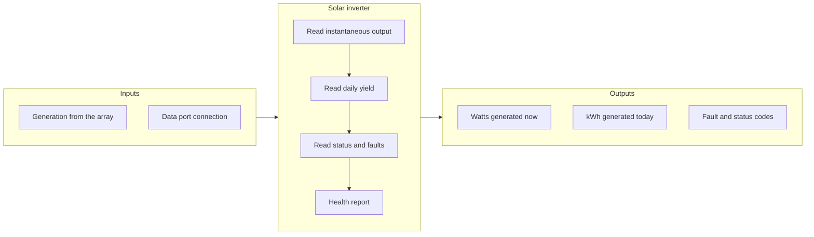

| Function | Trigger |
|---|---|
| Continuous measurement | `time` |
| Feeds net demand (consumption minus generation) | `time` |
| Feeds the demand limit | `condition` |
| Raises inverter faults | `event` |

**Decide before installing:** read-only, unless writes are genuinely required; which data port and protocol the inverter
offers; whether generation is netted off the demand limit; who to call when a fault code appears.

!!! warning "Check the installer's warranty before connecting anything"
    On many inverters a control connection, even an unused one, affects the warranty terms.

### 3.10 Battery storage — G

*Planned: no device class yet.* Reports stored energy and its flow. With a demand limit in place, a battery is what lets
you shave a peak without switching anything off.

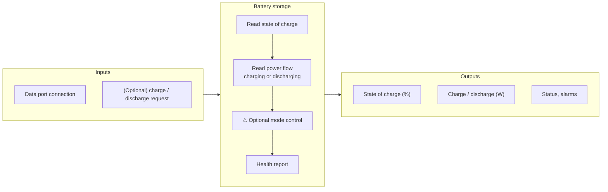

| Function | Trigger |
|---|---|
| Continuous measurement | `time` |
| Feeds net demand | `time` |
| Supports peak shaving | `condition` |
| (Optional) charge or discharge control | `command` |

**Decide before installing:** whether any write control is enabled at all; the reserve level that must never be
discharged; how it interacts with the demand limit; who owns the battery's own safety settings.

!!! danger "Leave write control off unless the installer approves it in writing"
    Battery charge settings affect safety and warranty, and an energy-management system is not the right owner of them.

### 3.11 Water heater controller — S

*Planned: no device class yet.* Switches a large, thermally buffered load. Usually the best load in the building to shed,
because nobody notices an hour without it.

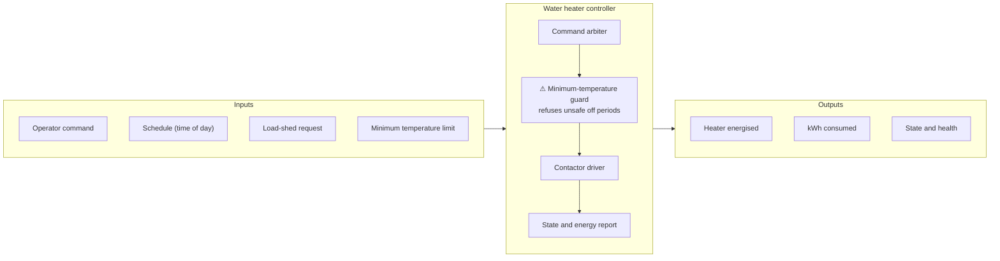

| Function | Trigger |
|---|---|
| On / off | `command` |
| Heat only during set hours | `time` |
| First to shed on a demand breach | `condition` |
| Energy measurement | `time` |
| Minimum temperature respected | `condition` |

**Decide before installing:** heating hours (usually overnight and before peak use); the minimum stored temperature that
must be maintained; the shed group (normally Group 1); any legionella or hygiene rule that applies.

### 3.12 Fan or pump controller — S

*Planned: no device class yet.* Switches a motor load, usually ventilation. It is the example device for demand-driven,
rather than clock-driven, operation.

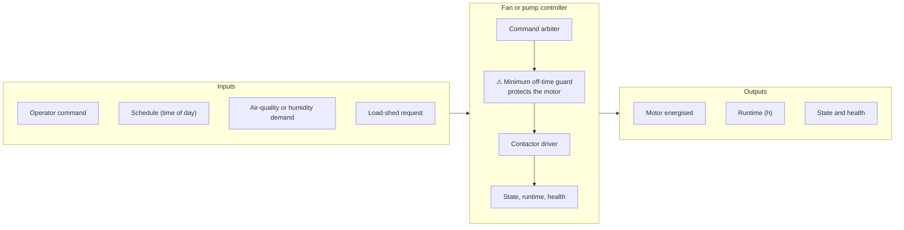

| Function | Trigger |
|---|---|
| On / off | `command` |
| Run during set hours | `time` |
| Run when air quality demands it | `condition` |
| Runtime hours for maintenance | `time` |
| Load-shed member | `condition` |

**Decide before installing:** the minimum off-time between starts (from the motor's data sheet); whether demand may
override the schedule; runtime hours between services; the shed group, if it may be shed at all.

!!! danger "Motors must not be cycled rapidly"
    Set a minimum off-time, and never allow a rule to switch a motor more often than its data sheet permits. Repeated
    starts destroy motors far faster than continuous running.

## 4. Choosing what you need

Start from what you want the building to do, not from a catalogue.

| If you want to… | You need | How many |
|---|---|---|
| Know what the whole building consumes | M | One, at the main incomer. |
| Know consumption by load type | M | One per branch circuit you care about. The highest-value purchase. |
| Switch lighting from a schedule or a screen | S | One per lighting circuit. |
| Switch plug loads outside working hours | MS | One per outlet or outlet group. |
| Control air-conditioning | C | One per unit, or one per group in line of sight. |
| Turn lights off when a room empties | E | One occupancy sensor per independently emptying space. |
| Hold a room to a comfort target | E + C | One sensor per room, plus the commander for its unit. |
| Dim or skip lighting on bright days | E | One daylight sensor per façade-facing zone. |
| Ventilate on need instead of on the clock | E + S | One air-quality sensor per room, plus fan control. |
| Include the building's solar | G | One, at the inverter's data port. |

Rows that need an occupancy, daylight or air-quality sensor, or a Source, need device types iBEMS does not support yet
(section 3).

!!! tip "Start small"
    **One main meter, three or four branch meters, and switching on your largest controllable load** is enough to prove
    the system and produce real savings. Add sensors after a month of data shows you where the energy goes.

## 5. Installing

!!! danger "Before any work"
    All work inside a distribution panel or on fixed wiring is performed, or directly supervised, by a **licensed
    electrical practitioner** under the Philippine Electrical Code. The circuit is **isolated, locked out and tagged,
    and proven dead** before anyone touches it. This manual does not replace that person's judgement. Panel procedure,
    conductor sizing and earthing are in [Field devices § Electrical installation](01-field-devices.md).

### M — Meters

- The circuit is isolated and proven dead.
- The clamp is on the correct conductor, with its arrow towards the load.
- One clamp = one named circuit, written down at once.
- The meter is powered from a circuit that stays on.
- The panel is photographed before it is closed.

### S — Switches

- Rated above the circuit's real load, not its nameplate.
- The manual override still works with the system off.
- Labelled at the panel with its short code.
- Never fitted to compressor loads.

### MS — Metered switches

- The load is within the device's rating, with margin.
- Each socket is recorded separately if it switches separately.
- Nothing critical is plugged in behind it.
- It is reachable without moving furniture.

### E — Sensors

- Away from direct sun, vents and doorways.
- At the height the reading should represent.
- Occupancy sensors cover the space, not the entrance.
- The battery type and change interval are recorded.

### C — Commanders

- Clear line of sight to the equipment.
- Every command you intend to use is tested.
- The equipment's supply is left permanently on.
- The command set is written down, because it cannot be recovered later.

### G — Sources

- The data port is identified, and read-only unless writes are truly needed.
- It is on the same network as everything else.
- The installer's warranty is checked before connecting.
- Any remote-control feature is left off.

!!! tip "Naming"
    Give every device its short code **before** installation, and label the physical device with it. A device you
    cannot identify from the panel is a device nobody will maintain.

## 6. Device states

Every device sits in one of four states. Choose your own thresholds, write them down, and use the same ones everywhere.

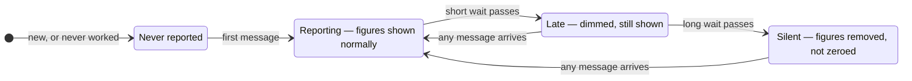

| Threshold | Suggested value (s) | The question it answers | How to choose yours |
|---|---|---|---|
| Short wait | 2.5 × the device's reporting interval | Should this be dimmed? | Long enough to survive one missed message. With a 60 s poll, that is 150. |
| Long wait | 300 | Is it still a measurement, or a memory? | Past this, show a dash instead of the figure. |
| Offline | 600 | Is it reachable at all? | Comfortably longer than your slowest normal gap. |

!!! note "As built in iBEMS"
    The short wait is declared per device class, at 2.5 × the measured reporting cadence. That is 150 s for devices
    polled every 60 s, and 30 s for devices whose readings are stamped when collected [E-110]. Figures are withdrawn after
    300 s, and a device is marked offline and dropped from totals after 600 s [E-111]. An earlier single 30 s budget made
    healthy outlets flicker to "late" twice a minute. That is why the budget follows the cadence, not a fixed number.

!!! info "The most important rule in this chapter"
    **A device that is not reporting shows nothing — never a zero.** No data and zero watts are different facts. Every
    total must exclude silent devices rather than adding them as zero.

!!! warning "Watch for this"
    **Judge a device by whether a message arrived, not by whether the number changed.** A working meter on a steady load
    repeats the same value for many minutes.

## 7. Troubleshooting

Work down in order, and stop as soon as the device returns. Each step costs more than the one above it.

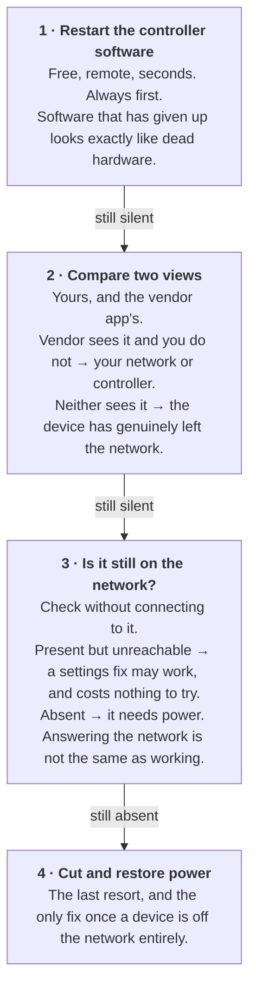

In iBEMS, step 1 is automated for the common case. A timer restarts the controller software when a device is reachable
but its connection has given up [E-022, E-118]. For step 3, use the neighbour table (ARP), not ping. A host that ignores
ping can still be on the network [E-117].

| Symptom | Most likely cause | Check that tells the causes apart | Fix | How to confirm it held |
|---|---|---|---|---|
| One device silent, the rest fine | That device, or its software connection | Does the vendor's app see it (step 2)? Does the neighbour table still hold its address (step 3)? | Restart the controller software, then follow the ladder [E-118] | It reports again and stays reporting past the offline threshold (600 s) |
| Many devices silent at once | The network, not the devices | Is the controller on the device network, and are the devices still associated with the access point? | Return the controller to the device network before touching any device. After a power cut, see [outage recovery](outage-recovery.md). | Devices return one by one, and the building total recovers |
| Readings frozen but the device shows online | A connection that died without saying so, or a value nothing asked for again | When did the last message actually arrive, not what does the status say? Is the device polled at all? [E-119] | Restart the controller software, and make sure every device is polled [E-056] | New messages arrive with fresh times. On a steady load the value itself may legitimately repeat. |
| A command reports success but nothing happens | A Commander: there is no feedback | Look at the equipment itself, or at the room sensor's trend after the command | Re-test the captured codes. Add a meter on that circuit if it recurs. | The next command visibly changes the equipment, and the room sensor moves |
| Devices drop and return through the day | The access point changing channel, or too many clients | The access point's channel history and client count at the time of the drops | Pin the channel, raise the client limit, or add a second access point | A full working day with no drops |
| Totals look too low | A silent device being excluded, correctly | Is any device marked silent or offline? | Restore that device. The total is right; the fleet is not. | The total rises as soon as the device reports again |

## 8. Improving over time

Do not attempt everything in the first year. Each level is worth starting only once the one above it is boring.

| Level | What you get | What to add | You are ready when |
|---|---|---|---|
| 1 | See | Meters and a dashboard. | Readings have run a month with no unexplained gaps. |
| 2 | Switch | Switches and metered switches, by hand. | Every command reaches the equipment and is recorded. |
| 3 | Automate | Schedules, then occupancy, daylight and comfort sensors. | Schedules have run two weeks without a surprise. |
| 4 | Optimise | Demand limits, automatic shedding, generation and storage. | You know your real peak from measured data. |

!!! warning "Before switching anything off automatically"
    Decide which circuits may be dropped, in what order, and which must never be. **Shed only, never restore
    automatically.** Switching a load off unattended can be undone by a person; switching it back on cannot.

---

The pilot installation, mapped onto these six roles, is in [99-worked-example](99-worked-example.md).
