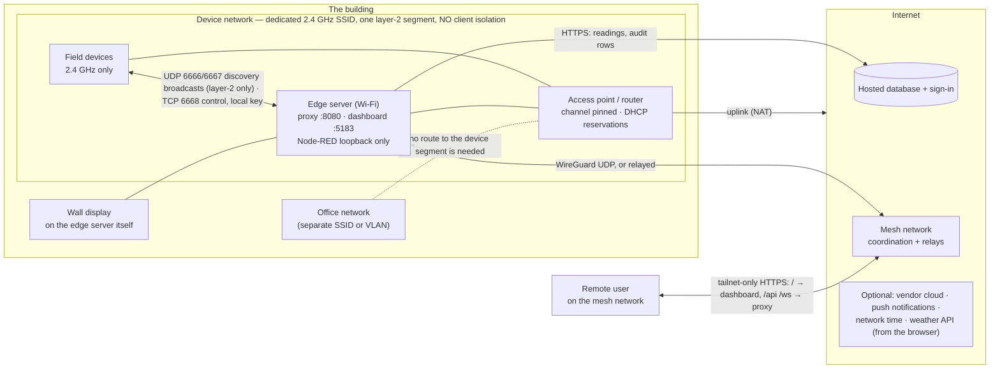

# Network and communication

Three networks meet at the edge server:
- the **device network**, where readings and commands travel
- the **uplink**, which carries the record to the hosted database
- the **mesh network**, which is how anyone reaches the building from outside

This chapter builds all three and says what each costs when it fails.

## What it is

**Figure 5 — the networks, generalised: no real names or addresses.** Source: [`diagrams/network.mmd`](diagrams/network.mmd).
What is drawn is the recommended arrangement. Where the pilot differs, the text says so.



### Why the device network is separate, and what that buys

The devices find each other, and the edge server finds them, by **broadcast** on the local segment. Broadcasts do not
cross a router or a VLAN boundary [E-159]. So the edge server **must sit on the same layer-2 segment as the devices**,
and that segment must not isolate its clients from one another.

A separate network buys three things:
- **Nothing on the office network can reach a device**, or anything the edge exposes to the device segment.
- **The office's own changes cannot break discovery:** client isolation, band steering, VLAN moves.
- **The devices' radio conditions are yours to manage:** the channel, the client count, the lease times.

It costs one access point and one SSID.

**What the device segment can reach on the edge** is exactly what listens on the edge's Wi-Fi interface:

| Port | Service | Should it be reachable from the device segment? |
|---|---|---|
| TCP 1880 | Node-RED | **No.** It is bound to loopback [E-019, E-133]. |
| TCP 1883 | MQTT broker | **No.** It is being restored to loopback (F-001) [E-028]. |
| TCP 8080 | Proxy | Yes, with a session: it is the only authenticated door [E-025] |
| TCP 5183 | Dashboard (static files) | Yes. It carries no data without a session. |
| TCP 5900 | VNC | **Decide** (F-007) [E-033] |
| TCP 22 | SSH | Keys only [UNVERIFIED: password auth not yet read, F-008] |
| UDP 6666, 6667, 7000 | Device discovery (inbound) | Yes: that is how devices are found [E-159] |

### The pitfalls institutional networks bring

| Pitfall | What it does to iBEMS | What to ask for |
|---|---|---|
| **Client (AP) isolation** | Devices and the edge cannot see each other's broadcasts: every device stays undiscovered | Isolation **off** on the device SSID |
| **Band steering / one SSID for 2.4 and 5 GHz** | The edge can be steered to 5 GHz. It then has internet and remote access while **every device reads offline**, which looks like a software fault. | A 2.4 GHz-only SSID for the devices |
| **Captive portal** | The devices cannot click through it, and the edge's uplink stalls | No portal on the device SSID |
| **Egress filtering** | The mesh network falls back to relays and gets slower, and the database or time servers may be blocked | Outbound HTTPS (443) and the mesh network's UDP allowed |
| **Short DHCP leases, and renumbering on power-up** | After an outage devices come back on new addresses, and nodes that found them by address lose them | Reservations for every device, and leases of a day or more |

### Addressing

Give **every device node a static address** and **reserve the same address on the access point**. A node with an address
connects directly, so discovery stops mattering. Without the reservation, the next power cycle renumbers the fleet
([outage recovery](outage-recovery.md)). You don't have to copy addresses by hand:
- `ibems-lan-map` learns each device's address and MAC from its own broadcasts every 10 min [E-022].
- `npm run set-device-ip:pi -- --host=127.0.0.1 --from-lan-map` sets the node addresses. It is a dry run until `--apply`.
- `--reservations` prints the table to enter on the access point.

`npm run preflight` fails `host_addresses` if a node has no address.

**A plan that scales to more buildings:** give each building its own device subnet, and use a fixed block within it
per role, for example meters, outlets and switches each in their own range. Then an address says what the device is.
This is a recommendation; the pilot uses one subnet.

### The local control path

Commands reach a device **over the LAN**, with that device's own **local key**, on **TCP 6668**, speaking the protocol
version the device announces [E-132, E-159]. No vendor cloud is involved.

| | |
|---|---|
| The credential | The device's local key |
| How it is obtained | A key tool's export, then Import keys [E-145] |
| Where it is stored | The proxy's credential store (mode 0600) and the device's flow node. Never in the repository or a document. |
| How it is rotated | By re-pairing the device, which issues a new key. Then re-import and rebind [E-145]. |
| What a factory reset breaks | The key and possibly the id: the device must be re-paired, re-keyed and rebound |

A vendor-cloud fallback exists for dispatch, and it is optional [E-155].

### Ports and protocols

| From → to | Protocol · port | Carries | Needs internet? |
|---|---|---|---|
| Device → edge | UDP 6666 / 6667 broadcast (and 7000) | Discovery announcements: id, product, version | No |
| Edge → device | TCP 6668 | Commands and polls, encrypted with the local key | No |
| Edge (loopback) | TCP 1880 | Proxy and ingest to Node-RED | No |
| Browser → edge | TCP 8080 (HTTP/WS), TCP 5183 | The app, live data, commands | No, on the LAN |
| Edge → hosted database | HTTPS 443 | Readings, totals, audit rows; sign-in verification | Yes, and it is buffered when down [E-078, E-134] |
| Edge ↔ mesh network | WireGuard over UDP, or relayed over HTTPS | Remote access; SSH | Yes |
| Edge → time servers | NTP (UDP 123) | The clock (there is no RTC) | Yes [E-014] |
| Browser → weather API | HTTPS | The weather card only | Yes [E-155] |

### The uplink, and what an outage does

**What needs the internet:** the hosted database, the sign-in service, the mesh network, network time, the optional
vendor cloud, push notifications and the weather card [E-155]. **Device control needs none of them.**

**Bandwidth.** One 60 s sample at the pilot measured about 15 kB/s up and 4 kB/s down, mesh traffic included [E-156]. A
day-long measurement has not been made [UNVERIFIED]. A modest broadband link is ample.

!!! info "During an internet outage — the paragraph to read first"
    **The building keeps working.**
    - **What continues:** readings are taken, schedules run, demand limits are enforced, and a person at the wall
      display or on the building's own network can switch loads. Sign-in is checked against a cached key, and every
      command is recorded in a local buffer before it is sent [E-066, E-078].
    - **What queues:** readings for the database, and command records. Both upload on their own when the link returns;
      this was observed on a real 7-minute outage with no data lost [E-134].
    - **What stops:** remote access, history charts that come from the hosted database, push alerts and the weather card
      stop until the link returns.

    A **power cut** is different: the edge, the access point and the devices all restart. See
    [outage recovery](outage-recovery.md) and [How it fails](#how-it-fails).

### Remote access

Remote access is a **mesh VPN** (Tailscale) [E-026, E-027]:
- **Tailnet-only HTTPS.** The edge serves the dashboard and the proxy to members of the mesh network over HTTPS.
  **Funnel is off**, so nothing is published to the public internet [E-026].
- **Tailscale SSH in check mode.** A browser re-approval is required from time to time. A session that hangs silently
  is waiting for that approval [E-154].
- **No key expiry on the edge node,** so the building does not drop off the mesh network on a timer [E-027].
- **What is deliberately not exposed:** Node-RED, and after F-001 the broker, both loopback-only. The database is
  reached only as a hosted HTTPS service. **No port forwarding is needed**, because remote access rides the mesh
  network. Whether the pilot's router forwards anything was not read [UNVERIFIED — confirm at site].
- **Review the access policy** (F-025). Every device signed into the account can open a shell on the edge, and the
  service account has passwordless sudo [E-160]. Restrict SSH to named admin devices, keep check mode on, and remove
  stale nodes.

## What you need

| Item | Specification that matters |
|---|---|
| Access point | 2.4 GHz, a dedicated SSID, client isolation **off**, DHCP reservations, a pinnable channel, and enough client capacity for every device plus the edge. The pilot's model is unrecorded [UNVERIFIED — confirm at site]. |
| Uplink | Any broadband link with outbound HTTPS and UDP |
| UPS | For the access point **and** the edge ([outage recovery](outage-recovery.md)) |
| Mesh-network account | **Institution-owned** (X1) |
| From campus IT | Whether they must provision the SSID or VLAN, and the answers to the pitfalls table [UNVERIFIED — confirm at site] |

## How to install

### Build the device network

**Precondition.** An access point you control, placed centrally to the devices.

**Who.** Integrator, with campus IT if required.

| Step | Action | Expected result |
|---|---|---|
| 1 | Create a **2.4 GHz-only** SSID for the devices, with WPA2 | It is visible, on 2.4 GHz only |
| 2 | Turn **client / AP isolation off** on it | — |
| 3 | Run `npm run rf:survey` on the edge and pick the clearest channel. **Adjacent-channel overlap is worse than sharing a channel.** | A channel with no partial overlap |
| 4 | **Pin that channel.** Don't use auto. | The AP stays on it across reboots |
| 5 | Set DHCP leases to a day or more | — |
| 6 | Join the edge server to this SSID, on site, at the edge itself, and give it the highest autoconnect priority | `nmcli` shows it active, with the highest priority [E-158] |
| 7 | Pair the devices to it ([01](01-field-devices.md)) | Each is heard on the LAN within seconds [E-146] |

**Done when.** `npm run preflight` passes `network_discovery`, and every device is online.

**Rollback.** Each step is a setting on the AP or a profile on the edge. **Never change the edge's Wi-Fi remotely**: a
wrong setting loses the host with nobody on site.

**Tested.** The pilot runs this arrangement. A survey on 2026-09-03 found its channel overlapping a strong neighbour
(see the header of `rf:survey`). Whether the channel is now pinned is not recorded, and RM-046 still lists it
[UNVERIFIED — confirm at site]. The procedure as a whole has not been re-run from scratch.

### Fix the addresses

```bash
# working directory: the repository on the edge server
npm run set-device-ip:pi -- --host=127.0.0.1 --from-lan-map            # dry run
cp ~/.node-red/flows.json ~/.node-red/flows.json.bak-ips-$(date +%F-%H%M%S)
npm run set-device-ip:pi -- --host=127.0.0.1 --from-lan-map --apply
npm run set-device-ip:pi -- --host=127.0.0.1 --reservations            # the table for the AP
```

**Done when.** `preflight` passes `host_addresses`, and every MAC is reserved on the AP.

**Rollback.** Restore the `flows.json` backup and restart Node-RED. The script also supports `--undo`.

### Enrol the edge in the mesh network

| Step | Action | Expected result |
|---|---|---|
| 1 | Install Tailscale on the edge and log in with the **institution's** account | The node appears in the admin console |
| 2 | Disable key expiry for the edge node | It never drops off on a timer [E-027] |
| 3 | Enable Tailscale SSH, **in check mode**, restricted to named admin devices | A new device must be approved in a browser |
| 4 | Publish the dashboard **tailnet-only**: `/` → `localhost:5183`, `/api` and `/ws` → `localhost:8080`. Never use Funnel. | `tailscale serve status` shows "(tailnet only)" [E-026] |

**Done when.** A mesh-network member reaches the dashboard over HTTPS, and signs in.

**Tested.** The resulting configuration is observed on the pilot [E-026, E-027]. Step 3's restriction is **not** in
place there (F-025).

## How to configure

| Setting | Where | Value |
|---|---|---|
| Device SSID autoconnect priority | the edge (`nmcli`) | Highest [E-158] |
| Wi-Fi preference timer | `ibems-wifi-prefer.timer` | Every 5 min, first at 90 s after boot [E-022] |
| Per-node address | the device nodes (`set-device-ip:pi`) | From the LAN map |
| AP reservations | the access point | From `--reservations` |
| Discovery timeout | the device nodes | 10,000 ms, well above the 5 s broadcast interval [E-132] |

## How to verify

| Check | How | Pass looks like |
|---|---|---|
| Radio | `npm run rf:survey` (read-only) | The device SSID's channel has no partial overlap with a stronger neighbour |
| Layer 2 | `ip neigh` on the edge. **Use ARP, not ping** [E-117]. | Every device's MAC resolves |
| Packet yield | The daily report's coverage per device | **≥ 99 % of expected minutes on a normal day.** The pilot's median was 99.9 % [E-157]. |
| End-to-end latency | Switch a load from the app while a second person watches | The fixture changes within a few seconds |
| Exposure | `ss -tln` on the edge | Only the ports in the table above, on the interfaces listed |
| Remote | From a mesh-network member | The dashboard loads over HTTPS. The edge node shows no expiry. |

## How to operate

- After every power cut, follow [outage recovery](outage-recovery.md), in order.
- Once a month, check the packet yield on the reports page against the ≥ 99 % threshold.
- Once a quarter, review the mesh-network members and remove stale nodes (F-025).

## How it fails

| Symptom | Likely cause | Check that tells the causes apart | Fix | How to confirm it held |
|---|---|---|---|---|
| Device unreachable but powered | Isolation on the SSID, or a node that has given up | Does the edge's `ip neigh` resolve its MAC [E-117]? Is the device announcing [E-146]? | Isolation off; restart Node-RED [E-118] | Online for an hour |
| Devices drop at particular times of day | Channel interference, or too many clients at busy hours | `rf:survey` at that time; the AP's client count | Pin a clean channel; raise the client limit, or add an AP | A full day with no drops |
| The whole segment is down | The AP is down, or the edge is on the wrong SSID | `nmcli con show --active` on the edge: which SSID? | Restore the AP. The preference timer returns the edge within 5 min [E-022]. | Devices return in order |
| Control works, telemetry does not | The uplink (ingest cannot write) or ingest itself | `journalctl -u ibems-ingest`: "wrote" lines, or buffering? | Restore the uplink. The buffer flushes itself [E-134]. | `buffered_row_count` returns to 0 |
| Latency degrades | Interference, or a relayed mesh path | `rf:survey`; `tailscale ping` shows relayed or direct [E-002] | A clean channel; allow the mesh network's UDP outbound | Direct path, commands in seconds |
| Address conflict | No reservation, or a manual address overlapping the DHCP pool | `set-device-ip:pi --reservations` against the AP's table | Reserve every device | No `ADDRESS DRIFT` in the fleet-recovery journal |
| Works in the vendor app, not from the edge | The edge is on another segment, or the node's version or key is wrong | Is the edge on the device SSID? Does the node's version match the announcement [E-132]? | Put the edge on the segment; re-key or rebind [E-145] | The node connects within a minute |
| Edge unreachable remotely | The mesh network needs re-approval, the uplink is down, or the node is offline in the mesh | Does SSH hang silently (check mode [E-154])? Is the site's internet up? | Approve in the browser; restore the uplink | Remote dashboard and SSH work |

## Field issue log

Site specifics are in [99](99-worked-example.md).

| Date | Symptom | Root cause | Fix | Evidence | Lesson |
|---|---|---|---|---|---|
| 2026-08-24/25 | "Client isolation" concluded twice | A ping to a Windows host got no reply, because the host's firewall drops ICMP (Confirmed) | Check with ARP instead | E-117 | A silent ping proves nothing about layer 2 |
| 2026-09-01 | Live data readable from the device network without a credential | Node-RED listened on every interface | Loopback only | E-133 | Whatever listens on the edge's Wi-Fi is on the device segment |
| 2026-09-03 | 4 of 20 devices online after a power cycle | The device SSID's channel was adjacent to a strong neighbour (Confirmed by survey) | Power-cycling the devices landed them on a clean channel. Pinning the channel is recommended (RM-046). | `rf:survey` header; [outage recovery](outage-recovery.md) | Adjacent-channel overlap is the destructive kind |
| 2026-09-21 | After a site power cut the edge landed on the office SSID, and the fleet went silent to discovery | The edge booted before the AP. The devices stopped announcing while still reachable. | Preference timer at 90 s / 5 min, static addresses from the LAN map, AP reservations | [outage recovery](outage-recovery.md) | Give every device an address, so that discovery stops mattering |

## What to keep on the shelf

| Spare | Why | Lead time |
|---|---|---|
| A second access point, pre-configured with the device SSID | The whole fleet depends on one radio | [UNVERIFIED] |
| A UPS for the access point and the edge | Removes the cold-boot sequence that silences the fleet | [UNVERIFIED] |
| A printed copy of the reservation table | Rebuilding the AP from memory renumbers the fleet | — |
