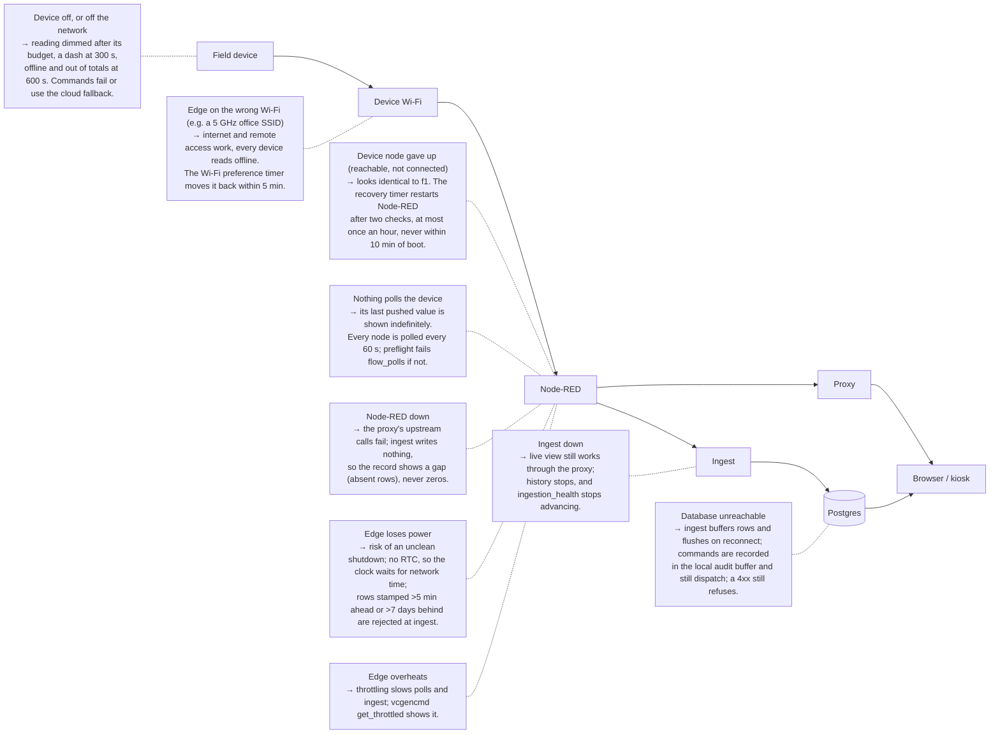

# Edge computing

The edge server is the one computer on site. It reads every device, decides, switches, and keeps the record going
when the internet does not. Logically it is L3. Physically it also hosts the L4 ingestion daemon and serves the L5 web
app, which is why the [deployment figure](00-overview.md#what-runs-where) puts all of them in one box.

## What it is

### The stack, as built

| Component | As built on the pilot | Why this one | Evidence |
|---|---|---|---|
| Board | Raspberry Pi 4 Model B, 8 GB class (7.6 GiB usable) | Cheap, well supported, low power. The pilot uses 2.2 GiB of memory and a load of about 2.6 on 4 cores. | E-011, E-016 |
| Power | USB-C, 5 V at 3 A (15 W) | The board's rated supply | E-144 |
| Clock | **No real-time clock.** Network time via `systemd-timesyncd`. | The Pi 4 has none. See [Time](#time). | E-014, E-144 |
| Storage | 128 GB SD card, ext4, `noatime`, 22 GB used | See [Storage](#storage-matters-more-than-the-processor) | E-012 |
| Operating system | Raspberry Pi OS on Debian 13 "trixie", **desktop** edition (lightdm, labwc) | The kiosk needs a graphical session | E-010, E-023 |
| Runtime | Node.js 22 (NodeSource package). The repo accepts `>=22 <25`, and CI tests 22 and 24. | Every daemon is plain Node with no external dependencies | E-017, E-067 |
| Flow engine | Node-RED 4.1.8 (global npm) with `node-red-contrib-tuya-smart-device` 5.4.0 (tuyapi 7.7.1) | Talks to the Tuya-ecosystem devices over the LAN, with no vendor cloud needed | E-018 |
| Static server | `serve` 14 (global npm) | Serves the built web app from `dist/` | E-021 |
| Supervision | systemd only: system units, one **user** unit for the kiosk, and timers | Restarts on failure and orders the start-up | E-021, E-022, E-023, E-024 |
| Remote access | Tailscale 1.102 (Tailscale SSH, tailnet-only HTTPS Serve) | See [02 Network](02-network.md) | E-026, E-027 |
| Broker (optional) | Mosquitto 2.0.21 | **No device uses it.** It is reserved for an inverter bridge (see findings F-001). | E-028, E-030 |

*Substitutes.* Any 64-bit single-board computer or small PC running Debian with systemd and Node 22–24 should run the
same stack. That is a Hypothesis: only a Pi 4 has been run.

### What runs, and what supervises it

| Unit | Runs | Restart policy | Starts after |
|---|---|---|---|
| `nodered.service` | Node-RED, on loopback:1880, with its memory capped at 512 MB and its journal rate-limited | on failure, after 20 s | network |
| `ibems-proxy.service` | `server/proxy.mjs`: the only authenticated door (:8080) | on failure, after 10 s | `nodered` |
| `ibems-ingest.service` | `server/ingest.mjs`: readings into the database every 60 s, plus retention, reports and the fleet alarm | on failure, after 10 s | `nodered` |
| `ibems-scheduler.service` | `server/scheduler.mjs`: schedules, auto-shed, the room-target loop | on failure, after 10 s | `nodered` |
| `ibems-dashboard.service` | `serve -s dist -l 5183`: the built web app | on failure, after 10 s | network |
| `ibems-kiosk.service` (**user**) | Chromium in `--kiosk` on the wall display | always, after 5 s | the graphical login. It waits for the Wayland socket, then for the dashboard to answer, before opening. |
| `ibems-lan-map.timer` | Learns device addresses from their own broadcasts (30 s listen) | — | 2 min after boot, then every 10 min |
| `ibems-fleet-recover.timer` | Restarts Node-RED when a device is reachable but its connection has given up. It needs two checks in a row, acts at most once an hour, and never within 10 min of boot. | — | 12 min after boot, then every 5 min |
| `ibems-wifi-prefer.timer` | Returns the edge to its preferred Wi-Fi profile (runs as root) | — | 90 s after boot, then every 5 min |

Evidence: E-020, E-021, E-022, E-023. All four long-running daemons had `NRestarts=0` at the audit.

### Node-RED: a generated bridge beside hand-built device tabs

The live flow has five working tabs [E-050]:
- **Four device tabs** (energy meters, outlets, switches, air-conditioner). They hold the device nodes, the parsers and
  the per-device state.
- **One generated bridge tab.** It serves `/api/devices`, `/api/readings/latest`, `/api/readings/history` and the
  2 s WebSocket push.

The bridge is **generated** from the device registry (`shared/registry.mjs` fed by `shared/sites/<site>/`) and appended
to the live flow by `deploy:pi`. The deploy never rewrites the device tabs [E-062]. On the pilot, every generated node
is live exactly as generated [E-052].

**Why generate it.** Adding a device is a row in one file, not a set of hand-wired nodes. The same registry feeds the
bridge, the mock bridge and the payload transform, so a second building is a new site directory, not a new flow. That
is the property that makes replication cheap.

**Two settings live only on the device tabs**: each device node's discovery timeout and protocol version. Nothing in
the repository declares them, so a restored old flow or a hand edit loses them silently, and every device then reads
offline [E-132]. The committed `node-red-bridge/live-flow-baseline.json` shows what they should be.

#### Node-RED settings that must be set

These live in `~/.node-red/settings.js`, which is not in the repository. The values are never written in any document
(G1).

| Setting | Must be | Why | Evidence |
|---|---|---|---|
| `uiHost` | `"127.0.0.1"` | The default is every interface. One port serves the admin API **and every http-in node**, so on all interfaces the device network could read live data with no credential. That was measured, then closed on 2026-09-01. Reach the editor with `ssh -L 1880:127.0.0.1:1880 <edge-user>@<edge-host>`. | E-019, E-133, E-140 |
| `adminAuth` | set | Protects the editor and admin API. The flow scripts authenticate as `NODE_RED_ADMIN_USER`. | E-019, E-042 |
| `credentialSecret` | set, **and kept somewhere off the card** | It encrypts `flows_cred.json`. If it is lost, those credentials cannot be recovered and must be re-entered. | E-019, E-140 |
| `contextStorage` | `localfilesystem` | Device state survives a Node-RED restart. The in-memory default forgets it. | E-019, E-046 |
| `httpNodeAuth` | not set | Acceptable **only** because of `uiHost` above. The http-in endpoints are reachable only from the edge itself, through the proxy. | E-047 |

### Parsing: raw datapoint to engineering unit

Each device reports integer datapoints. The parser on its device tab converts each one as **value ÷ 10^scale ×
unit factor**, using the scale and unit from the capability catalogue (`shared/deviceCapabilities.mjs`) [E-135]. The
catalogue is keyed by **product**, not by device class, because the same datapoint means different things on different
models. It is checked against the vendor's live device model with `npm run tuya:spec`. The parsers are generated from
it with `npm run fix-dp-parsers:pi`, which is a dry run until `--apply`.

| Measurement | Unit | Example scale | Raw → value |
|---|---|---|---|
| Power | W | 1 | 8159 → 815.9 |
| Voltage | V | 1 | 2270 → 227.0 |
| Current (meter) | A | 3 | 7692 → 7.692 |
| Current (outlet) | mA | 0 | → ÷ 1000 to amps |

**Values that fail validation** are caught at ingest:
- A non-finite or out-of-bounds value is stored as NULL and counted, never stored as-is.
- A row with an unusable timestamp is dropped.
- A timestamp more than 5 min ahead or 7 days behind is rejected.

[E-138, E-142]

### Offline behaviour

| When this is lost | What continues | What queues | What the user sees |
|---|---|---|---|
| **Internet** | Everything local: device reads, schedules, auto-shed, manual control from the kiosk or the LAN. Sessions verify against a cached signing key [E-066, E-078]. | Readings (ingest buffer) and command audit rows (audit buffer) upload on reconnect [E-078, E-134] | The live view keeps working. Remote access and the history charts, which come from the hosted database, are unavailable: a Hypothesis, not tested. |
| **The database only** | Same as above | Same as above. A database *refusal* (4xx) still refuses [E-128]. | The same, plus a backlog count on the Control page [E-078] |
| **Node-RED** | Nothing reaches the devices | Nothing. The record shows a **gap**, never zeros [E-082]. | The proxy's upstream calls fail [E-143]. What the page shows then has not been observed [UNVERIFIED]. |

### Time

The board has no real-time clock. Until network time is reached after a boot, the clock can be behind [E-014, E-144].
Ingest rejects any reading more than 5 min in the future or more than 7 days in the past, so a badly wrong clock loses
readings rather than filing them at the wrong time [E-142]. After a power cut **with no internet**, what the clock shows
until the network returns has not been observed [UNVERIFIED]. Check `timedatectl` for `System clock synchronized: yes`
after every cold boot.

### Storage matters more than the processor

A consumer SD card fails from writes long before the processor is the limit. This edge writes continuously:
- a persistent journal, capped at 200 MB [E-035]
- Node-RED's context files, 22 MB, with the bridge's 3.7 MB file rewritten continuously [E-046]
- logs, rotated [E-036]
- about 45 flow backups, on the same card [E-044]

Already in place: `noatime`, swap on zram, a weekly `fstrim`, a periodic ext4 check, and a rate limit on Node-RED's
logging [E-139].

The pilot's card is a consumer card made in 2018, with an unknown endurance rating [E-012]. Its last boot ran an
unclean-shutdown repair [E-013]. **Recommended for a new build:** an endurance-rated card or a USB SSD, and a spare card
imaged from the working one (F-015). This is a Hypothesis about wear: no failure has been observed.

### Power

An unclean shutdown can corrupt the card. The 2026-09-22 boot repaired orphaned files after one [E-013]. A small UPS in
front of the edge server removes that risk, and a clean shutdown is `sudo systemctl poweroff`. The pilot has no UPS
[UNVERIFIED: confirm at site].

### Settings that live only on the host

Everything below is on the edge and **not declared in the repository**, so a rebuild loses it with no diff (F-010).
`npm run preflight` checks some of it [E-130].

| Setting | Where | Checked by `preflight` |
|---|---|---|
| Node-RED bound to loopback | `settings.js` `uiHost` | yes (`bridge_not_exposed`) |
| Persistent, bounded journal | `/etc/systemd/journald.conf.d/50-ibems-persistent.conf` | yes (`host_journal`) |
| The recovery timers | `/etc/systemd/system/ibems-*.timer` | yes (`host_timers`) |
| A static address on every device node | the device tabs | yes (`host_addresses`) |
| Every device node polled | the device tabs | yes (`flow_polls`) |
| Discovery timeout and protocol version per node | the device tabs | no. Use `npm run local-probe:pi` against the baseline. |
| Broker on loopback only | `/etc/mosquitto/` | **no** (F-001) |
| `adminAuth`, `credentialSecret` | `settings.js` | **no** |
| VNC listener | `/etc/wayvnc/config` | **no** (F-007) |
| Mesh-network watchdog | `/usr/local/bin/tailscale-watchdog.sh` + timer | **no** |
| Desktop autologin (the kiosk depends on it) | `/etc/lightdm/` | **no** |

### A golden image?

Not used. The installer is the replication path. It stays current with the repository, can be read line by line, and
works on hardware nobody imaged [E-129]. Anyone who does produce an image must remove from it:
- `server/.env`
- `~/.node-red/flows_cred.json` and the `credentialSecret`
- `server/data/device-credentials.json`
- the device keys inside `flows.json`
- the mesh-network node identity

That list is general practice and has not been tested.

## What you need

| Item | Specification that matters | Evidence |
|---|---|---|
| Single-board computer | A 64-bit board with ≥ 4 cores. The pilot runs on 8 GB and uses about 2.2 GiB. **The minimum spec has not been tested** [UNVERIFIED]. | E-011, E-016 |
| Power supply | The board's rated supply. For a Pi 4: USB-C, 5 V, 3 A. | E-144 |
| Storage | Endurance-rated, ≥ the pilot's 22 GB used, with headroom. A USB SSD is better. | E-012 |
| Cooling | A heatsink or fan case. The pilot has throttled from heat. | E-015 |
| UPS | Rated for the edge server and the access point | F-015 |
| Display (optional) | For the kiosk. The pilot's is small (800×480); the UI is tested there (ROADMAP RM-100). | — |
| Accounts | A hosted Postgres project; the device keys (from a key-extraction export); optionally a Tuya cloud project; a mesh-network account. **All institution-owned** (X1). | E-042 |
| Skills | A Linux shell, systemd, SSH | — |

## How to install

### Prepare the operating system

**Precondition.** A blank card or SSD, the board, a screen and keyboard for first boot, and the device network's Wi-Fi
details.

**Who.** Integrator.

| Step | Action | Expected result |
|---|---|---|
| 1 | Write the 64-bit Raspberry Pi OS **desktop** image (Debian 13 base) to the card. In the imager, set the user name, the time zone and an SSH public key. | The image is written and verified |
| 2 | Boot the board with a screen attached | The desktop appears |
| 3 | Join the **device** Wi-Fi network (2.4 GHz), on site, at the board itself | `nmcli con show --active` lists the device SSID |
| 4 | Confirm the clock synchronised | `timedatectl` shows `System clock synchronized: yes` |
| 5 | Update the packages once: `sudo apt update && sudo apt full-upgrade` | It finishes with no errors |

**Done when.** You can `ssh` in with the key, and the board is on the device network.

**Rollback.** Re-image the card.

**Tested.** Untested as a procedure. It is described from the pilot's observed state [E-010, E-014, E-023] and the
installer's preconditions. **Never change the edge server's Wi-Fi remotely:** a wrong network loses the host with
nobody on site to recover it.

### Run the installer

**Precondition.** The operating system is prepared and has internet.

```bash
# working directory: the service user's home on the edge server
git clone https://github.com/bems2026/bems.git bems && cd bems
./scripts/install.sh            # dry run: prints the plan and changes nothing
./scripts/install.sh --apply    # does it
```

| Step | Action | Expected result |
|---|---|---|
| 1 | Run the dry run and read the plan | Eight numbered steps, each saying what it would do |
| 2 | Run with `--apply` | Node 22, the app build, Node-RED with the Tuya node, a loopback-only broker (only if newly installed), an empty `server/.env` (mode 600), four system units rewritten for your user and checkout, and the dashboard started |
| 3 | Read the closing list it prints | Seven manual steps: network, credentials, site, database, flow, verify, and the optional units |

**Done when.** `systemctl is-active ibems-dashboard` prints `active`, and `ibems-proxy`, `ibems-ingest` and
`ibems-scheduler` are enabled.

**Rollback.** The script is idempotent and overwrites nothing that has content [E-129]. To remove it:
`sudo systemctl disable --now ibems-dashboard ibems-proxy ibems-ingest ibems-scheduler`, then delete their files from
`/etc/systemd/system/`.

**Tested.** The apply path was rehearsed in a container with `systemctl` stubbed. **It has never been run end to end on
a real machine** [E-129]. Treat the first real install as that test.

### Add what the installer does not

**Precondition.** The installer has run.

| Step | Action | Expected result |
|---|---|---|
| 1 | Create `/etc/systemd/system/nodered.service.d/log-ratelimit.conf` from `server/nodered-log-ratelimit.conf`, then `sudo systemctl daemon-reload` | `systemctl cat nodered` shows the drop-in [E-020] |
| 2 | Create `/etc/systemd/journald.conf.d/50-ibems-persistent.conf` with `Storage=persistent`, `SystemMaxUse=200M`, `SystemMaxFileSize=32M` and `MaxRetentionSec=90day`, then `sudo systemctl restart systemd-journald` | `journalctl --disk-usage` survives a reboot. This file is not in the repository (E-139). |
| 3 | In `~/.node-red/settings.js`, set `uiHost: "127.0.0.1"`, `adminAuth`, and your own `credentialSecret`. Store the secret off the card. | `ss -tln` shows `127.0.0.1:1880` only |
| 4 | Install the recovery timers as each unit's header says: `server/ibems-lan-map.{service,timer}` and `server/ibems-fleet-recover.{service,timer}` | `systemctl list-timers` lists both [E-022] |
| 5 | Optional: `server/ibems-wifi-prefer.{service,timer}`, on site only | Listed in `systemctl list-timers` |
| 6 | Optional kiosk: enable desktop autologin for the service user, then install `server/ibems-kiosk.service` as a **user** unit (`systemctl --user enable --now ibems-kiosk`) | After a reboot, the display opens the dashboard with nobody signing in [E-023] |

**Done when.** `npm run preflight` reports `host_journal`, `host_timers` and `bridge_not_exposed` as passed.

**Rollback.** Each is a single file. Remove it, then `daemon-reload`.

**Tested.** Each setting is in place and working on the pilot [E-019, E-020, E-022, E-023, E-035]. The sequence as
written has not been run on a fresh machine.

### Deploy the flow

**Precondition.** `server/.env` holds `NODE_RED_ADMIN_USER` and `NODE_RED_ADMIN_PASS`, the site directory exists
([replication](replication.md)), and Node-RED is running.

```bash
# working directory: the repository on the edge server
npm run build:flow
cp ~/.node-red/flows.json ~/.node-red/flows.json.bak-$(date +%Y%m%d-%H%M)
npm run deploy:pi -- --host=127.0.0.1            # dry run: prints the plan
npm run deploy:pi -- --host=127.0.0.1 --apply    # appends the bridge
```

| Step | Action | Expected result |
|---|---|---|
| 1 | `build:flow` | `bridge-flow.json` regenerated. `npm run test:bridge` passes. |
| 2 | Back up `flows.json` | A dated `.bak` beside it |
| 3 | Dry run | The plan names only the bridge's nodes |
| 4 | `--apply`. Add `--force` only to replace an earlier bridge. | The bridge tab appears, and the device tabs are untouched [E-062] |

**Done when.** `npm run verify:pi -- --host=127.0.0.1` passes (see below).

**Rollback.** `cp` the `.bak` back over `flows.json`, then `sudo systemctl restart nodered`.

**Tested.** Yes, repeatedly on the pilot [E-052]. **Back up before every flow write, without exception.** The device
tabs carry settings that exist nowhere else [E-132].

## How to configure

### `server/.env`

The file exists only on the edge server, at mode 600, and is gitignored. **Names only here; values never go in a
document** (G1) [E-042, E-067].

| Name | Purpose | Needed when |
|---|---|---|
| `SUPABASE_URL` | The database's address | Always |
| `SUPABASE_SERVICE_ROLE_KEY` | Writes from ingest, the scheduler and the proxy. **Never in the browser.** | Always |
| `VITE_SUPABASE_ANON_KEY` | The public key, which the proxy uses to verify sessions | Always |
| `HARDWARE_DISPATCH_ENABLED` | The interlock. Unset means closed. Opening it is a signed-off commissioning step ([X2](X2-control-logic.md)). | Only when dispatch is signed off |
| `LIGHT_API_TOKEN` | Authenticates the proxy to the flow's command endpoints. The proxy **refuses to start** if dispatch is enabled without it [E-141]. | With dispatch |
| `NODE_RED_ADMIN_USER`, `NODE_RED_ADMIN_PASS` | For the scripts that read or write the flow | Deploying and maintaining the flow |
| `BREAK_GLASS_PASSWORD_HASH` | An optional local login for when the sign-in service is unreachable. It is view-only. | Optional |
| `TUYA_ACCESS_ID`, `TUYA_ACCESS_SECRET`, `TUYA_REGION` | The optional vendor cloud: fallback dispatch and device facts. **The most sensitive credential here**, because it reaches hardware directly. | Optional |
| `NTFY_TOPIC` | Push alerts | Optional |
| `PROXY_PORT` | The proxy's port | Optional |

Tuning names (poll and refresh intervals, buffer paths, retention days) have working defaults. They are listed in
`server/.env.example`.

### After changing code

Deploying is **two separate acts**, and a commit implies neither [E-131]:
- A change under `server/` or `shared/` needs `sudo systemctl restart ibems-ingest ibems-proxy ibems-scheduler`.
  `ibems-ingest` is the one that gets forgotten.
- A change under `src/` needs `npm run build`.

Which services a given file reaches is the restart map in [`pi-session-brief.md`](pi-session-brief.md).

## How to verify

| Check | Command (on the edge server, in the repository) | Pass looks like |
|---|---|---|
| The deployment | `npm run preflight` | `Ready`, with every check passed or explicitly unchecked. A check that could not run is never reported as passed [E-130]. |
| The bridge | `npm run verify:pi -- --host=127.0.0.1` | Exit code 0. It makes no writes. |
| Services | `systemctl is-active nodered ibems-proxy ibems-ingest ibems-scheduler ibems-dashboard` **and** `systemctl --user is-active ibems-kiosk` | `active` for each. The kiosk is only visible in user scope [E-023]. |
| Exposure | `ss -tln` | 1880 and 1883 on loopback only. 8080 and 5183 on all interfaces, by design. Decide 5900 (F-007). |
| Recording | `journalctl -u ibems-ingest --since '-5 min'` | `wrote N readings + totals` about every 60 s [E-086] |
| Clock | `timedatectl` | `System clock synchronized: yes` [E-014] |
| Heat and power | `vcgencmd measure_temp; vcgencmd get_throttled` | `0x0`: no under-voltage, capping or throttling since boot. The temperature trends well below where the pilot throttled (80 °C) [E-015]. |

## How to operate

| When | Do | Good looks like |
|---|---|---|
| Daily | Glance at the kiosk | Readings fresh; no silent devices you cannot explain |
| Weekly | `npm run preflight`; the temperature and throttle check; `df -h /`; `journalctl --disk-usage` | `Ready`; `get_throttled` = `0x0`; disk well under full; the journal under its 200 MB cap [E-035] |
| After any change | Both halves of the deployment, then read the live system back | See [After changing code](#after-changing-code) |
| Before any flow write | Back up `flows.json` | A dated `.bak` exists |
| Updates | Upgrade Node.js, Node-RED and the Tuya node deliberately, one at a time, then re-verify | Nothing upgrades them unattended. `unattended-upgrades` is not installed, and Node-RED is not an apt package [E-038]. The mesh agent does update itself (F-020). |

**Why the flow engine is never upgraded unattended.** A palette or runtime change can alter how device nodes behave,
and the symptom (every device offline) reads as a network fault. An upgrade someone did not watch is an outage nobody
can explain.

### Backup and restore

| What | Where | Backed up by | Restore tested |
|---|---|---|---|
| The database | Hosted | `npm run backup` ([backup-policy](backup-policy.md)) | **Yes**, into a throwaway PostgreSQL, 2026-09-22 [E-124] |
| `flows.json`, `flows_cred.json`, `settings.js` (with `credentialSecret`) | `~/.node-red/` | The operator's off-card copy [E-079] | **No** |
| `server/.env`, `server/data/device-credentials.json` | The repository checkout on the edge | The operator's off-card copy [E-079] | **No** |
| Code | Git | The public repository | Every clone |

**Restore drill.** Until someone does this, the edge backup is a Hypothesis (R4):
1. On a spare card, prepare the OS and run the installer.
2. Copy back the items in the second and third rows.
3. Start the services.
4. `npm run preflight` reports `Ready`, and every device reads online.

Record the date in `backup-policy.md`.

## How it fails

**Figure — what breaks at each hop, and what a person sees.** Source:
[`diagrams/failure-modes.mmd`](diagrams/failure-modes.mmd). Evidence: E-022, E-110, E-111, E-119, E-078, E-082, E-085,
E-134, E-142, E-143, E-015. What the page shows while Node-RED is down has not been observed.



| Symptom | Likely cause | Check that tells the causes apart | Fix | How to confirm it held |
|---|---|---|---|---|
| A service will not start | Missing values in `server/.env`, or dispatch enabled without `LIGHT_API_TOKEN` [E-141] | `journalctl -u <unit> -n 30` names the missing value, or prints "refusing to start" | Fill in the value, then `sudo systemctl restart <unit>` | `systemctl is-active` shows `active` after 5 min |
| It starts, then exits repeatedly | A crash on start: wrong Node version, a port in use, a broken module | `systemctl show <unit> -p NRestarts` rising; the first error in `journalctl -u <unit>` | Fix the first error. Check `node -v` is within 22–24. | `NRestarts` stops rising |
| The flow is deployed, but no device reports | The edge is on the wrong Wi-Fi; a device node's protocol version or timeout was lost; or nodes have given up | `nmcli con show --active` (device SSID?); `npm run local-probe:pi` against the baseline [E-132]; is the vendor app seeing the devices? | Rejoin the device network on site; restore the node settings; restart Node-RED [E-118] | Devices report within minutes, and stay reporting past 600 s |
| A reading never changes while the device shows online | Nothing polls that device, so its last pushed value is held [E-119] | Does `preflight` fail `flow_polls`? | Add the missing poll with the matching `poll-*:pi` script (dry run first) | New arrivals every 60 s |
| Memory grows over days | A leak in a flow or a node [UNVERIFIED: not observed] | `systemctl status nodered` memory, compared day to day; the heap cap is 512 MB [E-020] | Restart Node-RED. If it recurs, find the node by disabling tabs one at a time. | Memory stays flat for a week |
| Schedules fire at the wrong time | The clock is not synchronised (no RTC), or the wrong time zone | `timedatectl` (synchronised? zone?) | Restore network time; set the zone to the site's | A test schedule fires at its minute (X2a T3.1) |
| The system goes read-only or stops writing files | Card errors, after wear or an unclean shutdown | `dmesg \| grep -iE 'mmc\|ext4\|i/o error'`; `findmnt -no OPTIONS /` shows `ro` | Replace the card from the spare image; restore from backup | A week with no card errors in `dmesg` |
| "Address already in use" | Another process holds the port. The mock bridge cannot run on 1880 here, because Node-RED is on 1880. | `ss -tlnp \| grep <port>` | Stop the other process, or run the mock on `--port=1881` | The unit starts |
| State lost after a reboot | Journal or context not persisted | Is `journalctl --list-boots` more than one boot? Is `contextStorage` `localfilesystem`? | Add the journald drop-in; set `contextStorage` [E-136, E-019] | Both survive the next reboot |
| Blank dashboard after a flow import | The bridge tab missing or old, or a stale web build | `curl -s http://127.0.0.1:1880/api/readings/latest`; the bundle name served on :5183 against the latest build | Redeploy the flow; `npm run build` | The page fills within seconds |
| Slow polls, sluggish page, a hot board | Thermal throttling, or under-voltage | `vcgencmd get_throttled`: bit 16 set means under-voltage; 17–19 mean frequency capping, throttling or a soft temperature limit [E-015] | A proper cooler; a rated supply; lighten the kiosk (F-003) | `get_throttled` stays `0x0` across a working day |
| Code changed, the system did not | The daemon still runs the old modules [E-131] | `systemctl show <unit> -p ActiveEnterTimestamp` against the file's modified time | Restart all three daemons; rebuild for `src/` | The start time is after the change |

## Field issue log

Site specifics for each entry are in [99-worked-example](99-worked-example.md).

| Date | Symptom | Root cause | Fix | Evidence | Lesson |
|---|---|---|---|---|---|
| 2026-08-24 | Discovery failing thousands of times an hour | The discovery timeout (1 s) was shorter than the devices' 5 s broadcast interval | Raised to 10 s | E-132 | Measure the broadcast interval before suspecting the network |
| 2026-08-24 | Some devices never connect | The node declared the wrong protocol version | Matched each node to what its device announces | E-132 | Believe what the device announces, not what the flow declares |
| 2026-08-25 | A device diagnosed as a hardware fault | Its connection had given up in software (Confirmed) | A Node-RED restart; now automated | E-118, E-022 | Restart before you drive anywhere |
| 2026-09-01 | Live data readable from the device network with no credential | Node-RED bound to every interface | `uiHost` set to loopback; `preflight` now checks it | E-133 | A setting that lives only on the host needs something that notices when it goes away |
| 2026-09-13 | A fix committed and "deployed" changed nothing | The ingest daemon still ran modules from four days earlier | Restart all three daemons after `server/` or `shared/` changes | E-131 | A commit is not a deployment |
| 2026-09-17 | The broker open to the device network again | Its loopback listeners were commented out; who did it is unrecorded | Loopback-only restore chosen; the check is outstanding (F-001) | E-028, E-029 | The same exposure shape recurs; it needs a check, not a note |
| 2026-09-21 | The evidence of a device fault vanished | The journal was volatile, and two reboots erased it | A persistent, bounded journal | E-136 | Keep logs across reboots, bounded for the card's sake |
| 2026-09-22 | A circuit held a stale reading for hours | Nothing polled the meters, and the driver never reads on connect | A 60 s poll on every device; `preflight` fails without one | E-119 | A value nobody asked for again is a memory, not a measurement |
| 2026-09-23 | The board at 80 °C, throttling | Heat; the kiosk browser is the largest steady load (Hypothesis) | Pending a site check (F-003) | E-015, E-016 | Measure heat before blaming software for slowness |

## What to keep on the shelf

| Spare | Why | Lead time |
|---|---|---|
| A card or SSD imaged from the working edge server | The card is the most likely part to fail, and an image turns a rebuild into a swap | [UNVERIFIED] |
| A rated power supply | Under-voltage looks like software instability | [UNVERIFIED] |
| A second board of the same model | The whole site depends on one computer | [UNVERIFIED] |
| The off-card credential copy, and where it is | Without it, a rebuild means re-pairing every device [E-079, E-140] | — |
