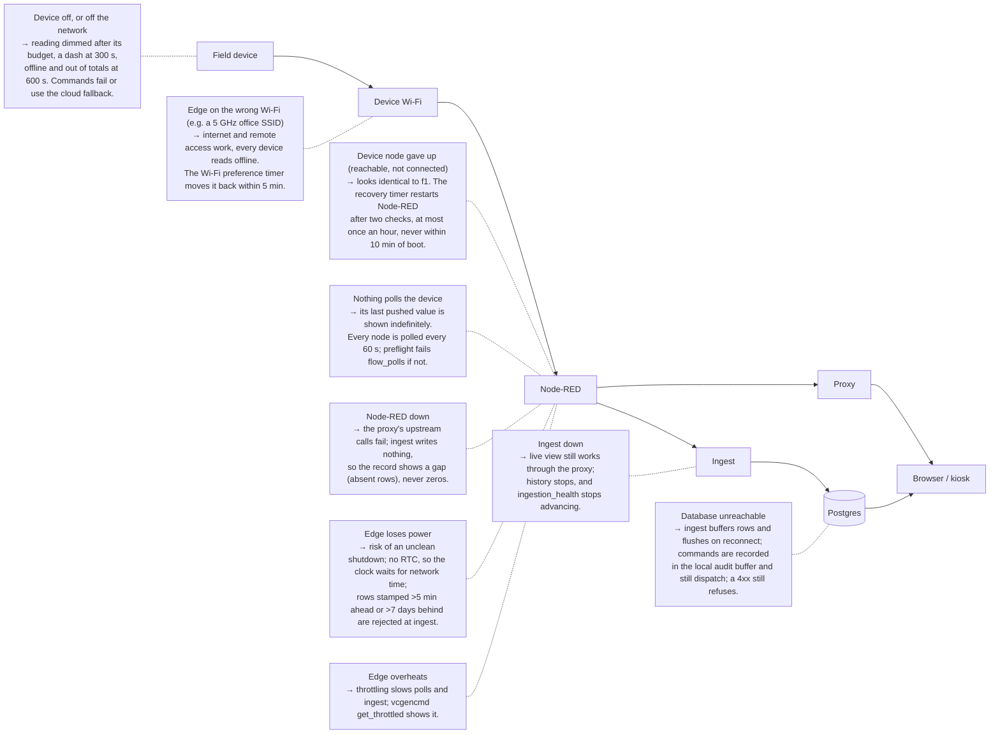

# Troubleshooting index

Start here when something is wrong and you do not know which part of the system to blame. Every row below is one
symptom from one chapter's fault table. The chapter holds the rest.

Three rules save the most time, in this order:
1. **Restart the controller software before suspecting hardware.** A device connection that has given up looks
   exactly like dead hardware ([01a § 7](01a-device-roles.md#7-troubleshooting)).
2. **Check the network by the neighbour table (ARP), not by ping.** A host that ignores ping can still be on the
   network ([02](02-network.md#how-it-fails)).
3. **Read the live system back after any fix.** A green test suite is not proof that the building changed
   ([`replication.md`](replication.md#traps-this-project-has-already-paid-for)).

For a power cut, go straight to [`outage-recovery.md`](outage-recovery.md).

## By symptom

<!-- GENERATED from each chapter's fault table. Edit the chapter, then regenerate; never edit rows here. -->

74 symptoms from 10 chapters. Find what you see, then follow the link: the chapter's row holds
the likely cause, the check that tells the causes apart, the fix, and how to confirm it held.

| Symptom | Layer or plane | Its five columns |
|---|---|---|
| The device never appears | L1 Field devices | [01 · How it fails](01-field-devices.md#how-it-fails) |
| It appears, then goes silent | L1 Field devices | [01 · How it fails](01-field-devices.md#how-it-fails) |
| Implausible values | L1 Field devices | [01 · How it fails](01-field-devices.md#how-it-fails) |
| Zero with load present | L1 Field devices | [01 · How it fails](01-field-devices.md#how-it-fails) |
| Switches from the kiosk, not from off site | L1 Field devices | [01 · How it fails](01-field-devices.md#how-it-fails) |
| Switches, but the state never updates | L1 Field devices | [01 · How it fails](01-field-devices.md#how-it-fails) |
| Two devices show the same identity | L1 Field devices | [01 · How it fails](01-field-devices.md#how-it-fails) |
| Stops responding after re-pairing | L1 Field devices | [01 · How it fails](01-field-devices.md#how-it-fails) |
| One device silent, the rest fine | L1 Device roles | [01a · Troubleshooting](01a-device-roles.md#7-troubleshooting) |
| Many devices silent at once | L1 Device roles | [01a · Troubleshooting](01a-device-roles.md#7-troubleshooting) |
| Readings frozen but the device shows online | L1 Device roles | [01a · Troubleshooting](01a-device-roles.md#7-troubleshooting) |
| A command reports success but nothing happens | L1 Device roles | [01a · Troubleshooting](01a-device-roles.md#7-troubleshooting) |
| Devices drop and return through the day | L1 Device roles | [01a · Troubleshooting](01a-device-roles.md#7-troubleshooting) |
| Totals look too low | L1 Device roles | [01a · Troubleshooting](01a-device-roles.md#7-troubleshooting) |
| Device unreachable but powered | L2 Network | [02 · How it fails](02-network.md#how-it-fails) |
| Devices drop at particular times of day | L2 Network | [02 · How it fails](02-network.md#how-it-fails) |
| The whole segment is down | L2 Network | [02 · How it fails](02-network.md#how-it-fails) |
| Control works, telemetry does not | L2 Network | [02 · How it fails](02-network.md#how-it-fails) |
| Latency degrades | L2 Network | [02 · How it fails](02-network.md#how-it-fails) |
| Address conflict | L2 Network | [02 · How it fails](02-network.md#how-it-fails) |
| Works in the vendor app, not from the edge | L2 Network | [02 · How it fails](02-network.md#how-it-fails) |
| Edge unreachable remotely | L2 Network | [02 · How it fails](02-network.md#how-it-fails) |
| A service will not start | L3 Edge | [03 · How it fails](03-edge.md#how-it-fails) |
| It starts, then exits repeatedly | L3 Edge | [03 · How it fails](03-edge.md#how-it-fails) |
| The flow is deployed, but no device reports | L3 Edge | [03 · How it fails](03-edge.md#how-it-fails) |
| A reading never changes while the device shows online | L3 Edge | [03 · How it fails](03-edge.md#how-it-fails) |
| Memory grows over days | L3 Edge | [03 · How it fails](03-edge.md#how-it-fails) |
| Schedules fire at the wrong time | L3 Edge | [03 · How it fails](03-edge.md#how-it-fails) |
| The system goes read-only or stops writing files | L3 Edge | [03 · How it fails](03-edge.md#how-it-fails) |
| "Address already in use" | L3 Edge | [03 · How it fails](03-edge.md#how-it-fails) |
| State lost after a reboot | L3 Edge | [03 · How it fails](03-edge.md#how-it-fails) |
| Blank dashboard after a flow import | L3 Edge | [03 · How it fails](03-edge.md#how-it-fails) |
| Slow polls, sluggish page, a hot board | L3 Edge | [03 · How it fails](03-edge.md#how-it-fails) |
| Code changed, the system did not | L3 Edge | [03 · How it fails](03-edge.md#how-it-fails) |
| Writes fail silently | L4 Data | [04 · How it fails](04-data.md#how-it-fails) |
| Duplicate rows | L4 Data | [04 · How it fails](04-data.md#how-it-fails) |
| Wrong time zone in a report | L4 Data | [04 · How it fails](04-data.md#how-it-fails) |
| A negative or doubled day | L4 Data | [04 · How it fails](04-data.md#how-it-fails) |
| Totals do not match the meter on the incomer | L4 Data | [04 · How it fails](04-data.md#how-it-fails) |
| Storage outruns the plan | L4 Data | [04 · How it fails](04-data.md#how-it-fails) |
| The project was paused by the host | L4 Data | [04 · How it fails](04-data.md#how-it-fails) |
| The UI is empty, but rows exist | L4 Data | [04 · How it fails](04-data.md#how-it-fails) |
| Kiosk screen blank or "This site can't be reached" | L5 Interface | [05 · How it fails](05-interface.md#how-it-fails) |
| Dashboard renders, every figure "—" | L5 Interface | [05 · How it fails](05-interface.md#how-it-fails) |
| Values stale with no warning | L5 Interface | [05 · How it fails](05-interface.md#how-it-fails) |
| Control button does nothing | L5 Interface | [05 · How it fails](05-interface.md#how-it-fails) |
| Login fails | L5 Interface | [05 · How it fails](05-interface.md#how-it-fails) |
| A chart shows zero where data is missing | L5 Interface | [05 · How it fails](05-interface.md#how-it-fails) |
| Works on the site network, not remotely | L5 Interface | [05 · How it fails](05-interface.md#how-it-fails) |
| Works remotely, not on the site network | L5 Interface | [05 · How it fails](05-interface.md#how-it-fails) |
| The app opens with no sign-in | L5 Interface | [05 · How it fails](05-interface.md#how-it-fails) |
| "This page stopped responding" | L5 Interface | [05 · How it fails](05-interface.md#how-it-fails) |
| An account nobody recognises | X1 Security | [X1 · How it fails](X1-security.md#how-it-fails) |
| Every command refused after rotating the light token | X1 Security | [X1 · How it fails](X1-security.md#how-it-fails) |
| Nodes fail after a Node-RED restore | X1 Security | [X1 · How it fails](X1-security.md#how-it-fails) |
| The editor or bridge reachable from the device Wi-Fi | X1 Security | [X1 · How it fails](X1-security.md#how-it-fails) |
| Remote SSH suddenly refused | X1 Security | [X1 · How it fails](X1-security.md#how-it-fails) |
| A schedule never fires | X2 Control | [X2 · How it fails](X2-control-logic.md#how-it-fails) |
| A schedule fires on the wrong day | X2 Control | [X2 · How it fails](X2-control-logic.md#how-it-fails) |
| Commands recorded but nothing moves | X2 Control | [X2 · How it fails](X2-control-logic.md#how-it-fails) |
| A load a person switched on goes off again | X2 Control | [X2 · How it fails](X2-control-logic.md#how-it-fails) |
| A shed load came back on | X2 Control | [X2 · How it fails](X2-control-logic.md#how-it-fails) |
| The aircon rule does nothing | X2 Control | [X2 · How it fails](X2-control-logic.md#how-it-fails) |
| A row stays at `dispatching` | X2 Control | [X2 · How it fails](X2-control-logic.md#how-it-fails) |
| A month with no report notice | X3 Operations | [X3 · How it fails](X3-operations.md#how-it-fails) |
| Days of data missing, found late | X3 Operations | [X3 · How it fails](X3-operations.md#how-it-fails) |
| The fleet offline after a power cut | X3 Operations | [X3 · How it fails](X3-operations.md#how-it-fails) |
| A change works, then vanishes after a rebuild | X3 Operations | [X3 · How it fails](X3-operations.md#how-it-fails) |
| A restore brings the flow back without its credentials | X3 Operations | [X3 · How it fails](X3-operations.md#how-it-fails) |
| Devices never appear at the bench | Replication | [90 · How it fails](90-replication.md#how-it-fails) |
| `site:check` fails on a new site | Replication | [90 · How it fails](90-replication.md#how-it-fails) |
| No saving can be shown | Replication | [90 · How it fails](90-replication.md#how-it-fails) |
| Commissioning tests fail with the interlock on | Replication | [90 · How it fails](90-replication.md#how-it-fails) |
| The installer still holds access months later | Replication | [90 · How it fails](90-replication.md#how-it-fails) |

## Where each hop fails

**Figure 6, repeated from [03](03-edge.md#how-it-fails): what breaks at each hop, and what a person sees.**

Source: [`diagrams/failure-modes.mmd`](diagrams/failure-modes.mmd).
<!-- /GENERATED -->
