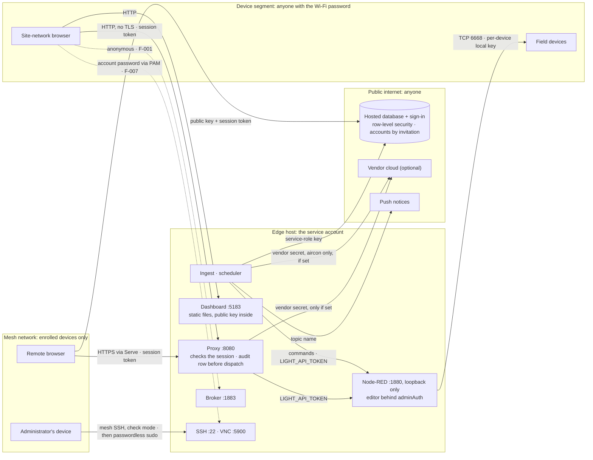

# Security and access

A fault in iBEMS does not corrupt a record: it switches a relay in an occupied building, or leaves a room dark. This
chapter lists every boundary, credential and account the system has, who can cross each one, and what to do when
something leaks or someone leaves.

It does not repeat two documents:

- [`SECURITY.md`](../SECURITY.md): how to report a vulnerability, and the rule that nothing identifying is ever
  committed.
- [`CONTRIBUTING.md`](../CONTRIBUTING.md): the same rule for contributors.

Values never appear here. Each credential is named with where it lives and how to replace it (G1).

## What it is

### Trust boundaries

**Figure 7 — who can reach what, and with which credential.** Solid arrows are the paths the system uses. Dashed arrows
are exposures open today, each with its finding.

Source: [`diagrams/trust-boundaries.mmd`](diagrams/trust-boundaries.mmd). Every browser also talks to the database
with the public key and its session; one arrow stands for all of them. Evidence: E-025, E-026, E-028, E-033, E-154,
E-160, E-189.

Four boundaries matter, from the widest to the narrowest:

| Boundary | Who is inside | What protects what is behind it |
|---|---|---|
| **The public internet** | Anyone | The database accepts nothing without a signed-in session; no policy grants the anonymous role anything [E-161]. Accounts are made only by invitation [E-176, E-177]. The public key in the page is public by design [E-171]. |
| **The mesh network** | Devices enrolled in the site's tailnet | Tailnet-only Serve, with Funnel off [E-026]. SSH to the edge asks for a browser re-check [E-154], but any enrolled device may open it (F-025). |
| **The device segment** | Anyone with the device Wi-Fi's password | The bridge listens on loopback only. **The broker and VNC do not** (F-001, F-007). The dashboard and the proxy listen on every interface; the proxy requires a session [E-025]. |
| **The edge host** | The service account, and anyone holding the SD card | File modes (600) against other local users. **Nothing against someone holding the card**: it is not encrypted [E-188]. The service account has passwordless sudo [E-160]. |

### The credential inventory

Where each value comes from is in [03 § server/.env](03-edge.md#serverenv). Every name in `server/.env` on the pilot
is listed [E-042].

| Credential | What it protects | Where it lives | Who reads it | How to replace it |
|---|---|---|---|---|
| **`TUYA_ACCESS_SECRET`** (with `TUYA_ACCESS_ID`, `TUYA_REGION`) | The vendor cloud API, which can command every device on the vendor account **with no row-level scoping**. The most sensitive credential in the system. | `server/.env` only, if set at all; optional since 2026-09-17 | The proxy, the scheduler (aircon only), `fleet-recover`, the vendor scripts [E-189] | Reset the secret in the vendor's developer console, put the new value in `server/.env`, restart the three daemons [E-131]. `[UNVERIFIED]`: the console's reset step was not exercised. |
| **`SUPABASE_SERVICE_ROLE_KEY`** | The whole database, **bypassing row-level security** | `server/.env` only | Ingest, the scheduler, `backup` and maintenance scripts. **Not the proxy**, and never a browser [E-189]. | In the provider's API-key settings. A newer secret key can be deleted by itself. A legacy key cannot: the provider's remedy is to deactivate the legacy keys and move to the newer ones [E-187]. If the public key changes too, rebuild the frontend. Which kind the pilot uses is not recorded (Q-19). Then update `server/.env` and restart the three daemons. |
| **Device local keys** | Local control of each device (TCP 6668) | `flows.json` on the edge; `server/data/device-credentials.json` (0600) | Node-RED; the proxy's enrolment | Only by re-pairing the device in the vendor app, which issues a new key. Then import it (*Devices → Add device → Import keys*, or `npm run keys:import`). A key does not change on restart [03](03-edge.md). |
| **`credentialSecret`** | `flows_cred.json`, the flow's stored credentials | `~/.node-red/settings.js`, as a literal [E-019] | Node-RED | **Never change it.** Node-RED cannot then decrypt the stored credentials, "and they will be lost" [E-186]. Keep a copy off the card (F-002). |
| **`NODE_RED_ADMIN_USER`, `NODE_RED_ADMIN_PASS`** | The Node-RED editor and admin API: full control of the flow | The hash in `settings.js` (`adminAuth`); the plain values in `server/.env` and the checkout's root `.env` | The proxy's admin client, the deploy scripts, `preflight` [E-189] | Hash a new password (`node-red admin hash-pw`), put the hash in `settings.js`, the value in both env files, then restart `nodered` and the proxy. `[UNVERIFIED]` on this site. |
| **`LIGHT_API_TOKEN`** | The flow's relay-write endpoint | `server/.env`; Node-RED's environment file, read by the flow's auth node | The proxy and the scheduler; the flow [E-189] | The live flow reads it with `env.get('LIGHT_API_TOKEN')` in four places [E-192], so a rotation changes no flow. Set the same new value in Node-RED's environment file and in `server/.env`. Restart `nodered`, then the three daemons. Until both match, every command is refused. (`npm run rotate-light-token:pi` was the one-time move from a hard-coded token to this.) |
| **`BREAK_GLASS_PASSWORD_HASH`** | The view-only local sign-in | `server/.env` (a scrypt hash, never the password) | The proxy | `node server/hashBreakGlassPassword.mjs`, paste the output into `server/.env`, restart the proxy. Rotate when anyone who knows it leaves. |
| **`NTFY_TOPIC`** | The out-of-dashboard notices. Knowing it lets someone read them, not act. | `server/.env` | Ingest [E-189] | Choose a new random topic, update `server/.env` and every subscriber, restart ingest |
| **`VITE_SUPABASE_ANON_KEY`** | Nothing by itself: it is public by design | The browser bundle; `server/.env` for the proxy | Every browser; the proxy | With the provider's keys (above). Then rebuild the frontend and restart the proxy. |
| **The service account's password** | VNC (through PAM) and local login; sudo does not ask for it [E-160] | The edge's system accounts | The operating system | `passwd` on the edge. Record who holds it. |
| **Wi-Fi passwords** | Membership of the device segment, and with it the broker, VNC and plain-HTTP traffic | The access point; NetworkManager profiles on the edge | Every device on the segment | Change on the access point, then **on site** on the edge and every device. Never remotely: a wrong value loses the host ([02](02-network.md)). |
| **Mesh network membership** | The remote dashboard and SSH to the edge | The tailnet's admin console | The mesh agents | Remove the device in the console. The edge's own node key never expires [E-027]. |

### Accounts

Five external accounts hold this system. **Each must belong to the institution, not to a person**, and be handed over
in writing when its holder changes. Who holds each on the pilot is open (Q-10).

| Account | What it controls | If it is lost |
|---|---|---|
| **Database provider** | The system of record, the database keys, sign-in, and invitations | History and control both stop. Backups are in [backup-policy](backup-policy.md). |
| **Mesh network** | Remote access and SSH to the edge | Remote access stops. On-site access still works. |
| **Vendor app** (Smart Life) | The devices' pairing, and so their local keys | Re-pairing every device under a new account |
| **Vendor developer account** | The optional cloud API | The cloud fallback stops. Local control is unaffected. |
| **Code host** | The repository and its CI | Changes stop. The running site is unaffected. |

Two more exist only if used: the account that owns the spreadsheet mirror (Q-09), and the push-notice topic, which has
no account.

### Authentication and authorisation, end to end

| Step | Proves who you are with | Allowed to | Evidence |
|---|---|---|---|
| Browser → sign-in service | Email and password. Accounts exist only by invitation. | Get a session (a signed token) | E-066, E-176 |
| Browser → database | The public key plus the session | What the `authenticated` policies allow, which is **everything the app can do: there are no roles** | E-163, E-170 |
| Browser → proxy | The session, verified by the proxy | Read the bridge; send a command. The proxy writes the audit row **with the caller's own session**, before dispatch. | E-065, E-189 |
| Browser → proxy, break-glass | A local password, checked against a hash | Read only: commands are refused with `break_glass_cannot_command`. 12 h, in memory. | E-172 |
| Scheduler → database | The service-role key | Read rules; write audit rows attributed to the rule's owner | E-164, E-189 |
| Proxy or scheduler → Node-RED | `LIGHT_API_TOKEN` | Move a relay | E-189 |
| Node-RED → device | The device's local key | Everything the device can do | [01](01-field-devices.md) |
| A person → Node-RED editor | An SSH tunnel, then the admin login | Change the flow | E-019, [03](03-edge.md) |
| A person → the edge's shell | Mesh SSH with a browser re-check | The service account, then root without a password | E-154, E-160 |

**Break-glass is recorded only as an attempt.** The proxy's journal logs each `POST /api/local-login` with its origin,
not its outcome, and nothing limits repeated tries (F-027). A successful break-glass session cannot command, so it
leaves no `commands` row.

### Repository hygiene

**The repository is public.** Never commit a token, a key, a password, a hostname, an address, a Wi-Fi name or the
database's project reference, in code, docs, screenshots or commit messages ([`SECURITY.md`](../SECURITY.md)). Three
habits keep it that way:

- **Stage files by name.** Never `git add -A` or `git add .`. Three dated copies of the env file, each holding the
  vendor secret and the service-role key, once sat untracked in the edge's checkout, one such command away from
  publication [E-190].
- **Rely on the ignore rules, which are written broadly:** `.env`, `.env.local`, `server/.env`, `server/.env.*`
  (except the example), `.env.bak*`, `*.env.bak*`, `.env.backup*`, `server/data/`, `/docs/audit/raw/` [E-190].
- **Scan before committing documentation** for addresses, keys, tokens and mesh names. A scan in CI is planned with
  the manual's publishing step (ROADMAP RM-145e). Past misses: real private addresses in two test fixtures (F-009),
  and two Wi-Fi names in a runbook (F-024).

**The day a secret is committed anyway:**

1. **Rotate it first**, at its source, as the inventory above says. The repository is public, so assume the value was
   copied the moment it was pushed. Deleting the commit does not un-publish it.
2. Put the new value in `server/.env` on the edge and restart what reads it.
3. Only then remove it from history (for example with `git filter-repo`) and force-push. That needs the repository
   owner. Ask the code host to purge cached views.
4. Record what leaked, when, and what was rotated, in ROADMAP.

### Physical security

- **The SD card is the whole system.** Holding it is holding every secret above, in plaintext [E-188]. Keep the edge in
  a locked room or enclosure. Wipe or destroy a card before it leaves the site. Where the pilot's edge sits, and how it
  is enclosed, are `[UNVERIFIED — confirm at site]` (Q-06).
- **Panels and devices.** A device that is factory-reset can be paired into anyone's app. Panel locks and access to
  the device locations are `[UNVERIFIED — confirm at site]` ([`physical-install.md`](physical-install.md), Q-13).
- **The kiosk is signed in.** Anyone standing at the wall display can switch every load, as whichever account signed it
  in. Give the kiosk its own account, so that its commands are recognisable in the audit trail.
- **The edge is not a workstation.** Its desktop session has been used for general browsing, with site data for other
  services in a second browser profile (F-022). Browse elsewhere.
- **Listeners on the device segment:** the dashboard (5183), the proxy (8080), SSH (22), VNC (5900), the broker (1883)
  and rpcbind (111) [E-025]. Only the dashboard and the proxy need to be there, and SSH is reachable over the mesh.
  See F-001, F-007 and F-014.

### Personal data

| Data | Where | Who can read it | Kept |
|---|---|---|---|
| Account email, sign-in times | The sign-in service | Administrators, in the provider's dashboard | Until the account is deleted, which the audit trail can prevent [E-184] |
| Who did what, and when | `commands.requested_by`; `updated_by` or `set_by` on rules, thresholds and configuration; an email snapshot beside tariffs and emission factors | Every signed-in account | **Never pruned** [E-193] |
| Request origins and a 12-character token prefix | The proxy's journal on the edge [E-191] | Anyone with a shell on the edge | As long as the journal keeps it |

The legal basis and the institution's obligations are in [93](93-governance-compliance.md).

### Threats

| Threat or mistake | What it achieves | Prevention | Detection |
|---|---|---|---|
| **An outsider signs up** | Arms a schedule that switches real loads | Sign-up off; accounts by invitation [E-176] | Accounts you do not recognise (Q-17); unknown ids in `commands.requested_by` |
| **A shared login** | Nobody can tell who did what | One account per person. The kiosk gets its own. | Activity from one account at two places at once |
| **Someone leaves** | They keep an account, a mesh device, and any shared password they knew | The offboarding list under [How to operate](#how-to-operate) | Compare the account list and the tailnet's devices with the staff list, quarterly |
| **A borrowed or lost laptop** | With the mesh and a browser session: the dashboard, and **a root shell on the edge** (F-025) | Narrow the SSH policy to named devices; the re-check in SSH [E-154]; remove the device from the tailnet | The tailnet console's *last seen*; SSH sessions in the edge's journal `[UNVERIFIED]` |
| **A factory-reset device** | iBEMS loses it. Someone else may pair it. | Physical access to devices | The device goes offline; the vendor app no longer lists it |
| **Anyone on the device Wi-Fi** | Read and publish on the broker; guess the VNC password; read plain-HTTP session tokens | Broker to loopback (F-001); VNC off or loopback (F-007); people use the mesh path | `ss -tln` on the edge |
| **A secret committed** | Depends on the secret; the vendor secret reaches hardware directly | Ignore rules, named staging, the scan | The scan; the code host's secret scanning `[UNVERIFIED]` |
| **The SD card taken** | Every secret, and the system with it | Locked location; an off-card copy of the credentials (F-002) | The edge goes silent |
| **The Node-RED editor exposed** | Full control of the flow | Loopback only; admin login; tunnel for access | `preflight`'s `bridge_not_exposed` |
| **`credentialSecret` lost or changed** | The flow's stored credentials become unreadable | Never change it; keep a copy off the card | Nodes that need a stored credential fail after a deploy |
| **Break-glass guessed** | A read-only view of the building | A long password; the fix under F-027 | `POST /api/local-login` in the proxy's journal |

## What you need

| Item | Specification that matters |
|---|---|
| Institution-owned accounts | The five above, each with a named role holding it (Q-10) |
| A place for secrets off the edge | Encrypted, holding `server/.env`, `settings.js`, `flows_cred.json` and `device-credentials.json` (F-002, E-079) |
| A locked location for the edge | [03](03-edge.md) |

## How to install

**Precondition.** The edge is installed ([03](03-edge.md)) and the database is set up ([04](04-data.md)).

| Step | Action | Expected result |
|---|---|---|
| 1 | In the database provider's sign-in settings, turn off "Allow new users to sign up" | `/auth/v1/settings` reports `disable_signup: true` [E-176] |
| 2 | Invite one account per person, and one for the kiosk | Each can sign in; nobody else can register |
| 3 | `chmod 600 server/.env` (the installer does this); confirm `server/data/device-credentials.json` is 0600 | `ls -l` shows `-rw-------` [E-043] |
| 4 | Set a Node-RED admin login and a `credentialSecret` before the first credential is stored | The editor asks for a login. `preflight` does not check either setting, so read them: `grep -cE '^\s*(adminAuth\|credentialSecret)\s*:' ~/.node-red/settings.js` prints `2` [E-019] |
| 5 | Keep the bridge, and the broker if installed, on loopback | `ss -tln` shows `127.0.0.1:1880`, and `127.0.0.1:1883` / `[::1]:1883` |
| 6 | In the tailnet's console, restrict SSH to named administrator devices and the service account; keep check mode | A session from any other device is refused |
| 7 | Copy the credentials off the card, encrypted, and write down where | A restore drill can find them (F-002) |

**Done when.** The checks under How to verify all pass.

**Rollback.** None of these steps needs one; each narrows access. If step 6 locks out the administrator, change the
policy back in the tailnet's console, which does not depend on the edge.

**Tested.** Steps 1, 3 and 4 hold on the pilot [E-176, E-043, E-019]. Steps 5 and 6 do not yet (F-001, F-025).
Step 7 is stated but not drilled (E-079).

## How to configure

| Setting | Where | Recommended |
|---|---|---|
| Sign-up | The provider's sign-in settings | Off |
| SSH policy | The tailnet's console | Named administrator devices only; check mode on |
| Node key expiry | The tailnet's console | Off for the edge (it has no one to re-authenticate it), on for people's devices [E-027] |
| Dispatch interlock | `HARDWARE_DISPATCH_ENABLED` in `server/.env` | Recorded as it is, never changed by this manual (G7). On the pilot it is on [E-041]. |

## How to verify

| Check | How | Pass looks like |
|---|---|---|
| No self-registration | `/auth/v1/settings`, read with the public key | `disable_signup: true` |
| Nothing anonymous in the database | Call the database's REST endpoint with the public key and no session | Nothing returned [E-161] |
| Only intended listeners | `ss -tln` on the edge | Node-RED and the broker on loopback; nothing unexpected on `0.0.0.0` |
| The bridge is not exposed | `npm run preflight` | `bridge_not_exposed` passes |
| Secrets are private on the card | `ls -l server/.env server/data/device-credentials.json` | Both `-rw-------` |
| Nothing identifying committed | The documentation scan; `git ls-files` searched for addresses and keys | No hits [E-100] |
| Accounts are known | *Authentication → Users* against the list of holders | One-for-one |

## How to operate

**Quarterly:** compare the account list and the tailnet's devices with the list of people who should have them. Remove
the rest. Confirm the off-card credential copy is current.

**When someone leaves**, in this order:

1. Ban or delete their database account. The database refuses to delete an account that has acted [E-184].
2. Remove their devices from the tailnet.
3. Rotate every shared secret they knew: the break-glass password, the service account's password, the Wi-Fi password
   if they had it (on site), and the Node-RED admin login.
4. Hand over any external account they held (see [Accounts](#accounts)).
5. Record the date and what was rotated.

**When a secret may have leaked:** rotate it first, as the inventory says, then investigate.

## How it fails

| Symptom | Likely cause | Check that tells the causes apart | Fix | How to confirm it held |
|---|---|---|---|---|
| An account nobody recognises | Created while sign-up was open, or invited by mistake | When it was created; whether it names any `commands` or rule rows | Ban it (or delete it, if it never acted); turn sign-up off | The account list matches the holders |
| Every command refused after rotating the light token | Node-RED's environment and `server/.env` disagree | The proxy's journal for the flow's 401 | Set the same value in both and restart `nodered` and the daemons | A command reaches `dispatched` |
| Nodes fail after a Node-RED restore | `credentialSecret` differs from the one that encrypted `flows_cred.json` | Compare with the off-card copy | Restore the original `settings.js` | The nodes connect |
| The editor or bridge reachable from the device Wi-Fi | `uiHost` lost in a rebuild | `preflight`'s `bridge_not_exposed`; `ss -tln` | Restore `uiHost: "127.0.0.1"` | `preflight` passes |
| Remote SSH suddenly refused | The tailnet's policy changed, or the device was removed | The tailnet console | Restore the policy; re-enrol the device | SSH connects, with the check |

## Field issue log

| Date | Symptom | Root cause | Fix | Evidence | Lesson |
|---|---|---|---|---|---|
| 2026-08-25 | Env-file backups with live secrets beside a public checkout | Backups named in ways the ignore rules did not match | Broad ignore patterns; named staging | E-190 | Ignore rules must anticipate names nobody has chosen yet |
| 2026-09-17 | The broker opened to every interface | A host change that nothing in the repository declares | Open: restore loopback (F-001) | E-028 | Host-only settings need a check that reads them |
| 2026-09-22 | Real private addresses in committed test fixtures | Fixtures built from a live file | Open (F-009) | E-101 | Build fixtures from documentation ranges |
| 2026-09-24 | Anyone could create an account | Sign-up left at the provider's default | Sign-up off | E-169, E-176 | With no roles, who can sign in is the whole access policy |

## What to keep on the shelf

| Item | Why |
|---|---|
| The list of account holders, by role | It is the access control |
| The encrypted, off-card credential copy, and where it is | Losing `credentialSecret` loses the flow's credentials for good |
| This chapter's offboarding list, printed | It is used on a bad day |
