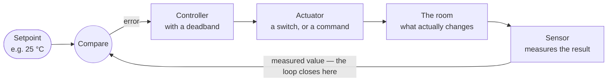
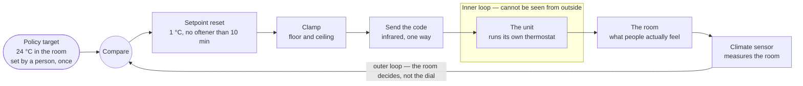
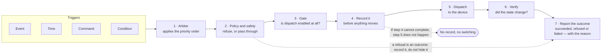

# Control strategy and test manual

How the system decides to act, how a trigger becomes a switched relay, and how to prove it all works. How iBEMS
implements each strategy is in [Control and automation logic](X2-control-logic.md). This chapter is the strategy it
implements.

| | |
|---|---|
| **Who this is for** | Whoever configures the automation, and whoever signs off that it works. |
| **Part one** | Triggers, control strategies, priority, and the control flow from trigger to relay. |
| **Part two** | A 34-test commissioning manual covering control, reliability, scheduling, automation and data logging. |
| **Before you begin** | [Device roles and catalogue](01a-device-roles.md), and at least one device of each role installed and reporting. |

## 1. Two questions, not one

Every automatic action answers two separate questions, and confusing them is why control systems get argued about.
**What started this?** is the *trigger*. **How was the decision made?** is the *strategy*. The same strategy can be
started by different triggers, and the same trigger can drive different strategies.

| Strategy — how it decides | Event | Time | Command | Condition |
|---|---|---|---|---|
| Open loop — send and hope | | ✓ | ✓ | |
| Feedback — measure and correct | ✓ | ✓ | | |
| Rule-based — if this, then that | ✓ | ✓ | ✓ | ✓ |
| Setpoint reset — trim until the room agrees | ✓ | ✓ | | ✓ |
| Demand-side — stay under a limit | | ✓ | | ✓ |

Rule-based control is the only strategy every trigger can start. That is why it becomes the default in most buildings,
and why its rules need a written priority order ([section 4](#4-priority-which-input-wins)).

## 2. The four triggers

Only four things ever start an action. If something did not happen, the first question is which of these you expected
to fire.

| Trigger | In plain terms | Example | Typical setting |
|---|---|---|---|
| `event` | The device reports a change by itself. | A relay opens; occupancy is detected. | Immediate. |
| `time` | A clock asks, or a clock acts. | Ask every device once a minute; lights off at 18:00. | Poll every 30–60 s; schedules to the minute. |
| `command` | A person presses something. | An operator switches a socket off. | On demand. |
| `condition` | A measured value crosses a limit you set. | Demand exceeds the limit; CO₂ exceeds the threshold. | Evaluated every cycle. |

!!! warning "A fifth thing that is not a trigger"
    **Silence.** When nothing arrives from a device, the system must react: mark it silent, withdraw its figures, and
    exclude it from totals. But silence changes what is *displayed*, never what is *switched*. A missing reading must
    never move a relay.

## 3. The six control strategies

### 3.1 Open loop

Send a command and assume it worked. Nothing measures the result. You do not choose this strategy. You are forced into
it whenever the equipment has no way to report back, as with infrared-controlled air-conditioning.

!!! warning "Rule"
    **Every open loop needs an independent check.** Put a meter on the circuit, or agree that a person reads the
    equipment's own display. Without one, "the command was sent" quietly becomes "the equipment is running", and nobody
    finds out until the bill arrives.

### 3.2 Feedback control

Measure the thing you care about, compare it to a target, and act on the difference. The loop closes because the result
of the action changes the measurement.

Without the return path from the sensor, this is section 3.1. The sensor is not an optional extra: it is the difference
between control and hope.

#### The deadband is the whole trick

A controller that switches the moment the measurement crosses the target will switch constantly, wearing out equipment
and never settling. A **deadband** turns that into a slow, comfortable cycle: switch on at one value, and off at a
clearly different one.

!!! example "Illustrative — not measured data"
    Cooling starts at the upper limit and stops at the lower one, so the room drifts gently between them. A narrower band
    holds temperature tighter but cycles the equipment more often. A wider band is kinder to the equipment and cheaper to
    run. **Start wide, and narrow it only if people complain.**

### 3.3 Setpoint reset — when the target and the dial are different numbers

An air-conditioner's thermostat measures the air *at the unit*, not where people sit. Set the remote to 24 °C and the
room often settles two, three or four degrees warmer. The offset depends on the room, the unit and the day. Somebody
usually discovers this by trial and error and writes "set it to 20" on a sticky note. That number is then wrong for
every other room and every cooler month.

**Setpoint reset removes the guess.** Policy sets the temperature you want *in the room*, and a sensor in that room
measures what is actually happening. The system then trims the number it sends to the unit, a step at a time, until the
room reaches the target. It trims it back when the room overshoots.

There are two loops, one inside the other. The inner loop is the air-conditioner's own thermostat: it is doing its job,
just measuring in the wrong place, and you cannot see inside it. The outer loop is yours: a sensor where people sit, and a
number you are allowed to change.

#### The rules, in full

| Setting | Recommended value | Why this one |
|---|---|---|
| Target (°C) | 24, in the room | What policy asks for. Never a raw unit setpoint: that number is meaningless outside one room. |
| Tolerance (°C) | ± 0.5 | 23.5 to 24.5 counts as reached. Tighter than this, ordinary sensor drift makes the setpoint hunt with nothing really changing. |
| Step (°C) | 1 | Most split units accept only whole degrees. Half-steps are silently rounded, so the system would think it acted when it did not. |
| Wait between steps (min) | 10 | The room takes several minutes to answer. Step faster and you are reacting to your own previous step, which is how overshoot happens. |
| Floor (°C) | 16 | The coldest the unit may be driven. |
| Ceiling (°C) | 26 | The warmest. It is needed because the loop must be able to come back up when the room over-cools. |
| Sensor goes silent | freeze | Hold the setpoint where it is. A missing reading is not a reading of zero, and it must never move the setpoint. |
| At the floor, still not reaching | hold + report | Stay at the floor and raise a fault after a set time. The cause is usually a door propped open, a missed code, or a unit too small for the room. |

!!! note "As built in iBEMS"
    - **Matches:** the tolerance, step and default wait (0.5 °C, 1 °C, 600 s), freezing on a silent sensor, and holding
      and reporting at a bound [E-112].
    - **Hard range:** 16–30 °C, the degrees the infrared library can send. There is no 26 °C ceiling, and the loop
      reports `ceiling_reached` at 30 °C [E-112].
    - **The floor a person's request is judged against** is a separate site-policy value, not the 16 °C hardware floor
      [E-113, E-120]. See 3.4.
    - The wait between steps is set per rule. The pilot's rule uses 300 s [E-113].

!!! example "Illustrative — not measured data"
    Take a hot room, a 24 °C policy target, and a unit that runs about four degrees warmer than its own dial. The
    setpoint walks down to 17 °C, the room crosses into the band, and the setpoint then walks back up and settles at
    20 °C. That is the offset for this room, found without anyone guessing it. **The overshoot is the price of a fixed
    step size**; a longer wait between steps reduces it.

!!! warning "Both directions or neither"
    **A loop that only steps down is not a loop; it is a slow way to freeze a room.** The cold side is not an optional
    refinement. Without it, the setpoint walks to the floor on the first hot afternoon and stays there through every mild
    morning that follows. The unit then runs flat out to hold a room nobody asked to be cold.

!!! tip "What this buys you beyond comfort"
    The unit never answers back, so before this the only proof a command landed was somebody walking over to look. Now
    the room is the proof. If the setpoint has stepped down four times and the room has not moved, something is wrong and
    the system can say so. That turns an open loop into a fault you can actually detect.

### 3.4 Rule-based and policy-based control

Rules are *if this, then that* statements you write. Policies are limits that no rule may cross, checked last, closest to
the equipment. Keeping the two separate is what stops a well-meant rule from breaking an institutional commitment.

| Kind | Example | Where it is enforced |
|---|---|---|
| Rule | If the room is empty for 20 minutes, switch the lights off. | In the automation configuration. Anyone with access can change it. |
| Rule | If CO₂ is above 1,000 ppm, run the fan until it drops below 800 ppm. | The same. Note the two different numbers: that is a deadband. |
| Policy | No air-conditioner may be set below 25 °C. | In the controller, checked on every command whatever its source. |
| Policy | Circuits marked critical may never be shed. | The same. A rule that tries is refused, not obeyed. |

!!! warning "Write policies as refusals, not as defaults"
    A default is a starting value someone can change; a policy is a boundary the system will not cross. If your energy
    commitment says 25 °C, the system should **refuse** a request for 18 °C and say why. It should not accept the request
    and quietly reset itself later.

!!! note "As built in iBEMS"
    iBEMS applies the comfort policy to **room targets**, where the setpoint-reset loop makes the decision, rather than to
    single commands:
    - **A rule aimed below the site's room-comfort floor is refused**, unless whoever saves it records a written reason.
      The exception is then permitted, but only on the record [E-121].
    - **A person's one-off setpoint below the policy floor is sent**, with a warning written into its command record.
      This was a deliberate change: once the setpoint became the lever a closed loop moves, refusing it left no way to
      hold a room on a hot afternoon [E-120].
    - **Only the hardware range (16–30 °C) is refused outright** [E-112, E-120].
    - Unassigned and protected circuits are never shed, as in the table [E-123].

### 3.5 Demand-side management

Many electricity tariffs charge for the highest demand reached in a period, not only for total energy. Demand-side
management keeps that peak under a limit you choose, by switching off the least important loads for a short time.

!!! example "Illustrative — not measured data"
    Picture the same day with and without a demand limit. Two short shed events keep the peak below the line. Total
    energy barely changes, but the peak, which is what a demand tariff bills, drops substantially. **Set your limit above
    your measured peak, never below it**, or the system will shed load on an ordinary busy afternoon.

| Setting | What to choose | Why |
|---|---|---|
| The limit | Above your measured peak, with margin. | A limit inside normal operation sheds load on a normal day, and staff lose trust in the system. |
| Shed groups | Group 1 sheds first, then 2, then 3. | Shed the least load that gets you under the limit. Water heaters and non-critical ventilation are usually Group 1. |
| One tier per check | Shed a group, wait, re-measure. | Dropping everything at the first breach is dramatic and unnecessary. |
| Restore | Manually, by a person. | Switching off unattended is recoverable; switching on is not. An automatic restore oscillates against the limit that caused it. |
| Unassigned loads | Never shed. | A circuit nobody classified is not a volunteer. |

!!! note "As built in iBEMS"
    iBEMS follows every row of this table: shed only, one tier per evaluation, restore by a person, and unassigned loads
    never shed. Its shed unit is a single socket, so the two sockets of one outlet can sit in different groups [E-123].

### 3.6 Predictive and optimising control

*Status in iBEMS: Planned, not built ([94-roadmap](94-roadmap.md)). Anomaly detection today is rolling statistics, not
prediction [E-076].*

Forecasting tomorrow's load, or pre-cooling a building before a price peak. **Deliberately out of scope for a first
system.** It needs a year of clean history to be worth anything, and a system that cannot yet be trusted to switch a
light on time will not be trusted to predict.

## 4. Priority: which input wins

Once you have more than one rule, two of them will eventually disagree about the same circuit. Decide the order *now*,
write it down, and make the system follow it. Reading from the top, the first line that applies wins.

| Priority | Input | What it covers |
|---|---|---|
| 1 | Safety interlocks | Minimum off-times, temperature limits. Nothing overrides these. |
| 2 | Manual override | A person at the wall switch, or an operator on the screen. |
| 3 | Institutional policy | Setpoint floors, protected circuits. Refused, not negotiated. |
| 4 | Demand shedding | Reaches only circuits with a shed group assigned. |
| 5 | Conditions | Occupancy, daylight, air quality, comfort setpoints. |
| 6 | Schedule | The clock. The baseline everything else modifies. |
| 7 | Default state | What the circuit does when nothing else has an opinion. |

Manual override sits second on purpose. If a person in the room cannot beat the automation, they will defeat it another
way: by taping over a sensor, or by having the whole system switched off.

!!! warning "Decide this too"
    **How long a manual override lasts.** Forever is wrong: someone switches a light on at 22:00 and it burns until they
    return. Until the next scheduled change is usually right.

## 5. Control flow, trigger to relay

Every automatic action, whatever started it, passes through the same seven stages. Knowing the order tells you where to
look when something did not happen.

Recording before acting, rather than after, is what makes "a relay moved with no record" impossible rather than merely
detectable. After the fact you can only notice the gap, because the relay has already moved.

!!! note "As built in iBEMS"
    - **Steps 3 and 4 are one step.** The record is written first, and it carries the gate's decision: a closed gate
      opens the row as `dry_run`, an open one as `dispatching`. Nothing is dispatched until the row exists [E-122, E-065].
    - **Step 6 happens in the browser.** It reconciles each pending command against the readings that follow it, and
      says so if the device never reports the new state [E-115].
    - Where the stages live in the code is in [Control and automation logic](X2-control-logic.md).

## 6. The load state machine

A controlled circuit is not simply on or off. These six states tell an operator not just what the circuit is doing but
*why*, which is the difference between a dashboard and a light switch.

| State | Means | Leaves this state when |
|---|---|---|
| Off — idle | Nothing is asking for it. | A schedule, a condition or a person asks. |
| On — scheduled | The clock is asking for it. | The schedule ends, or something higher takes over. |
| On — on demand | Occupancy, comfort or air quality is asking. | The condition clears, after its hold time. |
| On — manual hold | A person overrode the automation. | The override expires, or is released. |
| Off — shed | Demand management switched it off. | A person restores it. Never automatically. |
| Unavailable | The device is silent, or refused the command. | The device reports again. |

!!! tip "Why this matters on screen"
    "Off" tells an operator nothing. **"Off — shed at 14:12 by the demand limit"** tells them what happened, that it was
    deliberate, and that restoring it is their decision. Most complaints about building automation are really complaints
    about not being told.

## 7. What good control looks like

The point of all this is a smaller, flatter load. Layering the strategies gives most of the saving in the first two
steps.

!!! example "Illustrative — not measured data"
    These are typical proportions when control is added one layer at a time to an office:
    - **Schedules alone** remove out-of-hours waste, and usually give the largest single reduction.
    - **Occupancy and comfort control** take a further slice.
    - **Demand limiting** barely changes total energy, but it reshapes the peak.

    **Your building's numbers will differ. Measure yours before promising anything.**

## 8. Test manual

Thirty-four tests across the five areas a working system has to prove: the handbook's thirty-three [E-114], plus T4.11,
added so the manual tests where iBEMS actually enforces its comfort policy. Print this section, tick as you go, and
sign the sheet at the end.

!!! warning "Before you start"
    Run the whole manual with **automatic shedding switched off**. Arm it only after suite T4 passes, with someone
    watching the loads. Record the date, who ran each test, and anything that did not behave as written. A test that
    "nearly" passed is a test that failed.

### T1 — Control

*A command from a person reaches the equipment, and only the equipment it named.*

| Test | Do this | Pass looks like | ✓ | By |
|---|---|---|---|---|
| T1.1 | Switch each controllable circuit on and off from the screen. | The load changes within a few seconds, observed by a second person. | ☐ | |
| T1.2 | On a multi-socket device, switch one socket only. | Only that socket changes. The other is untouched. | ☐ | |
| T1.3 | Request an air-conditioner setpoint outside the unit's range. Then request one inside the range but below your policy floor. | The first is refused with a message naming the range, and nothing is sent to the unit. The second is sent, and the warning appears in its command record. This is how iBEMS applies policy to one-off commands [E-120]; the refusal lives at the rule, see T4.11. | ☐ | |
| T1.4 | Attempt a command on a meter or sensor. | Refused as not controllable. No error, and no silent acceptance. | ☐ | |
| T1.5 | Operate the manual switch at the device while the system is running. | The load follows the person, and the system reports the new state. | ☐ | |
| T1.6 | Open the record of commands after the tests above. | Every command appears once, with what was asked, by whom and when. | ☐ | |

### T2 — Reliability

*The system survives the things that will actually happen to it.*

| Test | Do this | Pass looks like | ✓ | By |
|---|---|---|---|---|
| T2.1 | Restart the controller software. | All services return by themselves. No command is lost or repeated. | ☐ | |
| T2.2 | Cut power to the controller, wait a minute, and restore it. | It boots unattended to a working system. The display returns without anyone signing in. | ☐ | |
| T2.3 | Disconnect the internet, then switch a load. | Control still works. The building does not depend on the connection. | ☐ | |
| T2.4 | Reconnect the internet. | Records made during the outage upload, and the backlog returns to zero. | ☐ | |
| T2.5 | Cut and restore power to one device. | It returns to the state you configured for a power cut, and you know which state that is. | ☐ | |
| T2.6 | Unplug a device and wait past your offline threshold. | It is marked silent, its figures disappear, and building totals drop by its share, not to zero. | ☐ | |

### T3 — Scheduling

*The clock does what the calendar on the wall says it does.*

| Test | Do this | Pass looks like | ✓ | By |
|---|---|---|---|---|
| T3.1 | Set a schedule a few minutes ahead, for today only. | It fires once, at the stated minute. | ☐ | |
| T3.2 | Check it fired on the correct day of the week. | The day matches. Test this near a weekend: off-by-one day errors are common and invisible. | ☐ | |
| T3.3 | Set a schedule for a day that is not today. | It does not fire today. | ☐ | |
| T3.4 | Disable a schedule and wait for its time. | Nothing happens. | ☐ | |
| T3.5 | Create a schedule without recording who saved it. | It is refused, or it never fires. An unattributed automatic action is not acceptable. | ☐ | |

### T4 — Automation

*Conditions in the building drive the equipment, safely and without thrashing.* Tests T4.1–T4.3 apply only where that
sensor role is installed; iBEMS has no device class for them yet ([device catalogue](01a-device-roles.md#3-device-catalogue)).

| Test | Do this | Pass looks like | ✓ | By |
|---|---|---|---|---|
| T4.1 | Enter a room with occupancy control, then leave it. | Lights on within seconds. Off only after the full hold time, not before. | ☐ | |
| T4.2 | Cover the daylight sensor, then uncover it. | Lighting is released below the threshold and suppressed above it, with no rapid switching at the boundary. | ☐ | |
| T4.3 | Raise air quality above the threshold: a full room, or breathe near the sensor. | Ventilation starts, and stops only after the level falls below the lower limit. | ☐ | |
| T4.4 | Watch comfort control for one hour. | Temperature stays inside the deadband, and the equipment cycles slowly: several minutes per cycle, not seconds. | ☐ | |
| T4.5 | Set a room target well below the current room temperature, and watch for an hour. | The setpoint sent to the unit steps down 1 °C at a time, never more often than the wait you configured, and stops once the room is inside the band. | ☐ | |
| T4.6 | Cool the room past the target: drop the target, then raise it back. | The setpoint steps back up. A loop that only ever goes down has failed this test. | ☐ | |
| T4.7 | Set a target the unit cannot reach, and wait. | The setpoint stops at the floor and stays there, and the room is reported as unable to reach target. It does not keep trying to go lower. | ☐ | |
| T4.8 | Unplug the room sensor mid-cycle. | The setpoint freezes at its last value. A missing reading never moves it. | ☐ | |
| T4.9 | With shedding OFF, drive demand above the limit. | The breach is reported. Nothing switches. | ☐ | |
| T4.10 | Arm shedding, with a witness watching the loads. Breach the limit again. | One group sheds. Nothing restores by itself. A person restores it, and that is recorded. | ☐ | |
| T4.11 | Try to save a comfort rule whose room target is below the site's policy floor, first without a reason and then with one. | Refused without a written reason. Accepted with one, and the reason is kept on the rule [E-121]. | ☐ | |

### T5 — Data logging

*The record can be trusted well enough to base a decision, or a claim, on it.*

| Test | Do this | Pass looks like | ✓ | By |
|---|---|---|---|---|
| T5.1 | Review a full day of readings for every device. | Readings at the stated interval, with no gap you cannot explain. | ☐ | |
| T5.2 | Find a period when a device was silent. | A gap in its data, never a run of zeros. | ☐ | |
| T5.3 | Check building totals during that same period. | The total excludes the silent device rather than adding zero for it. | ☐ | |
| T5.4 | Compare daily energy either side of midnight. | The counter rolls over cleanly. No negative day, and no doubled day. | ☐ | |
| T5.5 | Export a month and open it in a spreadsheet. | It opens with the correct columns, and the figures match the screen. | ☐ | |
| T5.6 | Check data older than your detailed-retention period. | Still present, in summary form. Summarised, not deleted. | ☐ | |

### Sign-off

| Field | Entry |
|---|---|
| Date | |
| Site | |
| Tested by | |
| Witnessed by | |
| Tests passed (of 34) | |
| Outstanding items | |
