<!-- One card per device TYPE (not per brand), in the form 01a-device-roles.md §3 uses. Vendor-neutral: roles are
     M Meter · S Switch · MS Metered switch · E Sensor · C Commander · G Source. -->

```mermaid
flowchart LR
  subgraph IN ["Inputs"]
    direction TB
    i1["<input>"]
  end
  subgraph FN ["<Device type> controller"]
    direction TB
    b1["<function block>"] --> b2["<function block>"] --> b3["<output block>"] --> b4["<health block>"]
  end
  subgraph OUT ["Outputs"]
    direction TB
    o1["<output, with its unit>"]
  end
  IN --> FN --> OUT
```

### <n>. <Device type> — <Role code>

*Supported in iBEMS: <Field-validated | Bench-validated | Implemented, not validated | Planned: no device class yet>
[<E-NNN>].* <One or two sentences: what it does for the building, and why you would fit one.>

| Function | Trigger |
|---|---|
| <what it does> | `command` · `time` · `event` · `condition` |

**Decide before installing:** <the settings someone must choose and write down, in the order they matter>.

<!-- Optional: a warning or danger callout for the one mistake that destroys equipment or trust. -->
